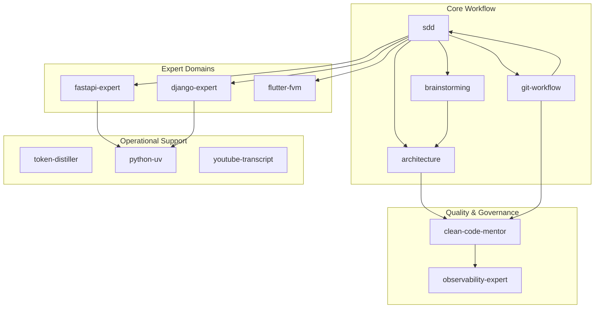

# Global Engineering Mandates (SDD v2.3.0 Observable)

These instructions are fundamental and must be followed by all agents operating in this Hub. They prioritize logic-first governance, deterministic SDD workflows, and centralized project memory.

## 🔒 0. SESSION BOOTSTRAP (EXECUTE BEFORE ANY RESPONSE)
Before responding to the user, the agent **MUST** perform this mental and operational checklist:
0. **Mode Check**: Verify `.hub-mode` and apply `token-distiller` guidelines.
1. **Rehydrate Context**: Read `.specs/project/STATE.md`, `MEMORY.md`, and `LEARNINGS.md`.
2. **Onboarding Alignment**: Consult `PROJECT-ONBOARDING.md` and the `sdd` skill to align with the project culture.
3. **Task Sizing**: Classify task complexity (Quick, Small, Medium, Large, Complex) according to the SDD table.
4. **Skill Matching**: Consult the **Skill Router** below to select the appropriate tools.
5. **SDD Verification**: If it is a development task, validate if `spec.md` and `plan.md` exist in `.specs/features/[feature]/`.

## 📍 SKILL ROUTER
Use this guide to identify the mandatory skill for each context:

| If the task involves... | USE this skill |
|-------------------------|----------------|
| Specification & Planning | `sdd` (`orchestrator`, `planner`) |
| Python & Environment | `python-patterns` (Decision Matrix) + `python-uv` (includes Django/Async expert domains) + `django-expert` + `fastai-expert`|
| Architecture & ADRs | `architecture` |
| Quality & Clean Code | `clean-code-mentor` |
| Knowledge Management | `skill-factory`|
| Mobile (Flutter) | `flutter-fvm` |
| Observability & SRE | `observability-expert` |
| Git & Versioning | `git-workflow` |
| Token Management | `token-distiller` |

> [!TIP]
> **Skill Chain Loading**: Skills are often interdependent. For example, `python-patterns` should always be followed by `python-uv` and a domain expert like `django-expert` to ensure architectural alignment from decision to implementation.

## 1. SDD Framework (Mandatory for Development)
Any construction, development, or significant refactoring task **MUST** utilize the **SDD (Spec-Driven Development)** framework.
- **Workflow & Persistence**: Upon technically completing a task, the agent **MUST** proactively perform SDD Phase 4 (Review & Persistence).
- **Artifact Ownership**: All technical specifications, plans, and task lists must reside in `.specs/features/[feature_name]/`.
- **State Synchronization**: Keep `STATE.md`, `MEMORY.md`, and `LEARNINGS.md` updated manually at the end of every significant milestone.

## 2. Architectural Integrity
- **Architecture-First**: Critical decisions must be recorded in an **ADR** (Architectural Decision Record) in the `.specs/architecture/` folder.
- **Diagram-as-Code**: All technical drawings and flows must use **Mermaid** syntax integrated into Markdown.
- **Logic-First**: Avoid hidden logic or CLI dependencies for governance; all rules must be visible in Markdown.

## 3. Quality Standards (Clean Code)
- Strictly follow **SOLID, YAGNI, DRY, and KISS**.
- Prioritize simplicity and maintainability; avoid over-engineering.
- All code must pass verification (manual audit or automated tests).

## 4. Knowledge Management
- **Local Knowledge Graph (LKG)**: Every new feature or significant architectural change **MUST** be updated in the Central Knowledge Map (see below).
- **Relationship Mapping**: Before major refactors, analyze the impact on existing entities and relationships using the knowledge map.

### 🗺️ Central Knowledge Map (Ecosystem)


## 5. Mandatory Skill Usage
- **Skill-Driven Execution**: Identifying and using the most appropriate skill for each task is mandatory. Executing technical activities without the support of a specific skill's instructions is prohibited.

## 6. Version Control & Git
Every agent **MUST** strictly follow the project's versioning standards as defined in [git-workflow/SKILL.md](.agents/skills/git-workflow/SKILL.md):
- **English-Only Commits**: All commit messages must be written in **English**.
- **Conventional Commits**: Use the standard format (`feat:`, `fix:`, `docs:`, `chore:`, `refactor:`).
- **Atomic Commits**: Commits must be atomic and, whenever possible, reference task IDs from `tasks.md`.
- **History Integrity**: Use `rebase` to maintain a linear history before merging into `main`.
- **Isolated Execution (Worktree)**: For **Medium+** tasks or when working on parallel features, agents **MUST** use `git worktree` to maintain isolated environments and prevent context contamination between branches.


## 🔒 7. SESSION EXIT GATE (EXECUTE BEFORE ENDING)
Before ending the session or delivering the task, the agent **MUST** validate:
1. **Validation**: Check if all Acceptance Criteria (ACs) from `spec.md` were met.
2. **Tasks Update**: Does `tasks.md` reflect the real state of implementation?
3. **State Sync**: Has `STATE.md` been updated with progress and next steps?
4. **Learnings Capture**: Update `LEARNINGS.md` with new patterns or fixed bugs.
6. **Audit Pass**: Execute `make audit` and ensure "100% COMPLIANT" status. Failures MUST be fixed before session delivery.
7. **Knowledge Update**: Refresh the Central Knowledge Map (embedded in Section 4) if the project structure or skill relationships changed.

## 8. Single Source of Truth (Root First)
The root directory is the ONLY allowed location for editing instructions and skills.
- **Root-Only Edits**: Agents MUST NEVER edit `.agents/`, `.agent/`, `.claude/`, or `.gemini/` folders directly.
- **Conflict Resolution**: If a divergence is detected, the root version always prevails. Any improvement found in runtime folders must be backported to the root.
- **Mandates Governance**: From now on, any changes to global mandates must be made exclusively in `.specs/codebase/GLOBAL_MANDATES.md`, followed by the `make sync` command to propagate the changes to the entire ecosystem.

## 9. Observable Governance (Gated Workflow)
Every action must be traceable and permission-gated by the SDD state machine:
- **State Machine Integrity**: You MUST NOT change the global `phase` in `STATE.md` until all tasks of the current phase are marked `[x]`. A task CANNOT be marked as completed unless there is verifiable evidence (commit hashes or logs) that the application builds successfully, passes the linting, and passes all tests.
- **Metadata Mandate**: Every Markdown artifact created or modified MUST end with the `<!-- @sdd-state -->` block.
- **Initial State Policy**: All new feature artifacts must be initialized with `status: IN_PROGRESS`. Only freeze to `status: COMPLETED` when transitioning between handoff points.
- **Prohibited**: Never jump to `VERIFY` phase without completing the `IMPLEMENT` cycle.

---

<!-- @sdd-state -->
```yaml
version: "2.3.0"
feature_id: "GOVERNANCE-HARDENING"
phase: "IMPLEMENT"
status: "COMPLETED"
last_update: "2026-05-09T12:08:00Z"
evidence_checksum: "b134813"
```
