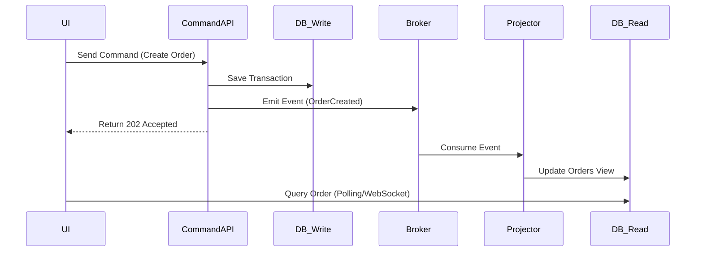

# CQRS & Event-Driven Design

This guide details the application of high-performance patterns for distributed and scalable systems.

---

## 1. CQRS (Command Query Responsibility Segregation)

CQRS proposes the separation between data modification logic (Commands) and data reading logic (Queries).

- **Write Side (Commands)**: Focused on validating business rules and ensuring transactional integrity. Generally uses a normalized database or Event Store.
- **Read Side (Queries)**: Focused on reading performance. Uses denormalized databases, caches, or search indexes (e.g., Elasticsearch, Redis).
- **Synchronization**: The write side notifies the read side about changes through events (Projections).

**When to use**: When the read volume is drastically higher than the write volume or when data views require complex joins that degrade the main database.

## 2. Event-Driven Architecture (EDA)

Systems where communication occurs via the emission and consumption of asynchronous events.

- **Event**: A representation of something that has already happened in the past (e.g., `OrderPlaced`, `UserRegistered`).
- **Broker**: The intermediary that manages messages (e.g., RabbitMQ, Kafka, AWS EventBridge).
- **Producer/Consumer**: Total decoupling; the producer does not know who consumes the message.

## 3. Critical Strategies

### A. Idempotency
Ensure that processing the same message multiple times does not generate side effects.
- **Technique**: Use a `Unique Message ID` and check in a control table (`Idempotency Key`) before processing.

### B. Eventual Consistency
Accept that data on the Read Side may take a few milliseconds (or seconds) to reflect the write.
- **Impact**: UI design should provide for "processing" states or optimistic updates.

### C. DLQ (Dead Letter Queue)
Queue to which messages that have failed repeatedly are sent for manual analysis or later reprocessing.

## 4. Event Sourcing (Optional)

Instead of storing the object's current state, the full sequence of events that led to that state is stored.
- **Advantage**: Total auditability and ability to reconstruct the state at any point in time.
- **Disadvantage**: High implementation complexity and need for `Snapshots`.

---

## Flow Example (Mermaid)

