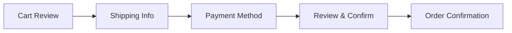
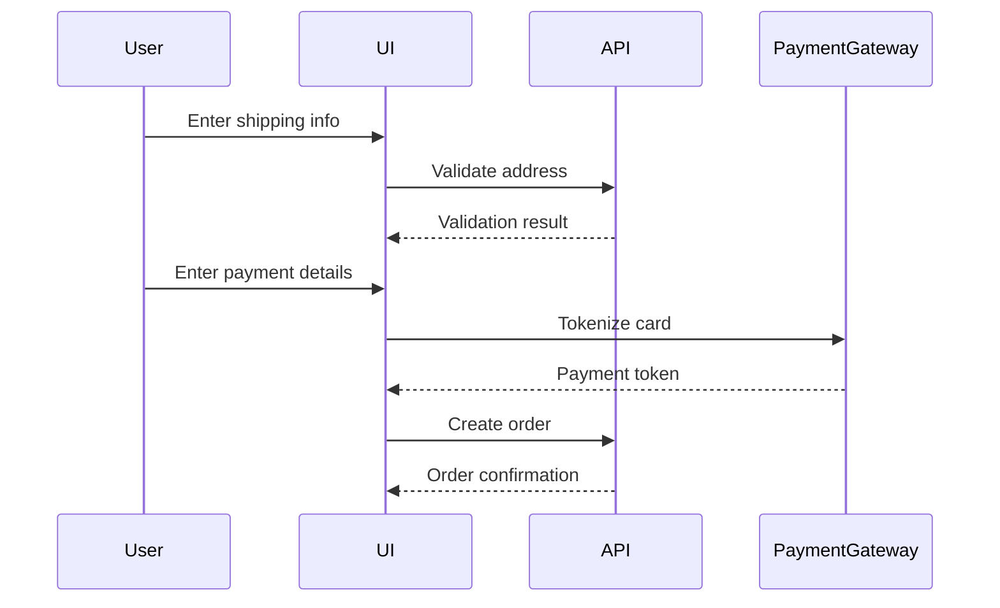

# Design Specification Example

## Project: E-commerce Checkout Flow

### Understanding Lock

**Objective:** Redesign the checkout flow to reduce cart abandonment from 70% to 50%.

**Non-goals:**
- Not changing the payment gateway integration
- Not modifying the product catalog
- Not implementing a full redesign of the entire site

**Premises:**
- Users are abandoning due to complex multi-step checkout
- Mobile users have the highest abandonment rate
- Current checkout has 5 steps

---

## Design Specification

### Architecture Overview

The new checkout will use a **single-page progressive disclosure** pattern:

### Key Features

#### 1. Progressive Disclosure
- Show only current step
- Previous steps are collapsed but accessible
- Clear progress indicator

#### 2. Mobile-First Design
- Large touch targets (44px minimum)
- Simplified input fields
- Auto-fill support

#### 3. Real-time Validation
- Inline error messages
- Disable submit until valid
- Visual feedback on success

### Technical Approach

**Frontend Stack:**
- React with Server Components
- React Hook Form for form management
- Zod for validation
- Tailwind CSS for styling

**State Management:**
- Local state for form data
- TanStack Query for API calls
- Context for checkout progress

**API Integration:**
- Existing payment gateway (no changes)
- New checkout validation endpoint
- Order creation endpoint

### Data Flow

### Success Metrics

- **Primary:** Cart abandonment rate < 50%
- **Secondary:** Checkout completion time < 3 minutes
- **Tertiary:** Mobile checkout completion rate increase by 20%

---

## Decision Log

### Decision 1: Single-Page vs Multi-Page Checkout

**Options:**
1. Single-page progressive disclosure ✅ **CHOSEN**
2. Multi-page wizard
3. Modal-based checkout

**Rationale:**
- Single-page reduces perceived complexity
- Progressive disclosure maintains focus
- Better mobile experience
- Easier to implement state persistence

**Trade-offs:**
- More complex frontend state management
- Requires careful error handling

### Decision 2: Form Validation Strategy

**Options:**
1. Real-time validation ✅ **CHOSEN**
2. Submit-time validation
3. Hybrid approach

**Rationale:**
- Immediate feedback improves UX
- Reduces form submission errors
- Aligns with modern UX patterns

**Trade-offs:**
- More API calls for validation
- Requires debouncing for performance

### Decision 3: Payment Flow

**Options:**
1. Client-side tokenization ✅ **CHOSEN**
2. Server-side processing
3. Redirect to payment page

**Rationale:**
- Better security (card data never hits our servers)
- Faster checkout experience
- Industry standard approach

**Trade-offs:**
- Requires payment gateway SDK integration
- More complex error handling

---

## Trade-off Matrix

| Approach | Complexity | Speed to Build | User Experience | Maintenance |
|----------|-----------|----------------|-----------------|-------------|
| **Single-Page** | Medium | Medium | High | Medium |
| Multi-Page | Low | Fast | Medium | Low |
| Modal | High | Slow | Low | High |

---

## Next Steps

1. **Phase 1:** Implement checkout UI components
2. **Phase 2:** Integrate form validation
3. **Phase 3:** Connect to payment gateway
4. **Phase 4:** A/B testing with 10% of users
5. **Phase 5:** Full rollout based on results

---

## Handoff

**For the Lead Developer:**
- Start with `frontend-expert` skill
- Focus on mobile-first responsive design
- Use the existing payment gateway integration
- Implement real-time validation with Zod
- Create A/B testing infrastructure

**Key Files:**
- Design spec: `.specs/design/checkout-flow.md`
- API contracts: `.specs/api/checkout-endpoints.md`
- Component specs: `.specs/components/checkout-components.md`

**Success Criteria:**
- All checkout steps implemented
- Mobile responsive design validated
- Payment integration working
- A/B testing infrastructure ready