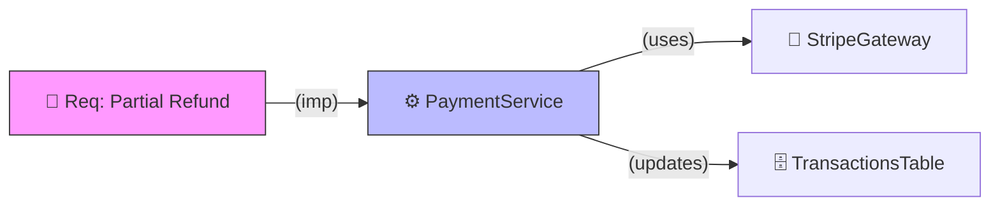

# Gold Standard Output: Knowledge Mapping

## 1. Relational Mapping (KNOWLEDGE-MAP.mermaid)
The agent generated a clear mapping focusing on cause and effect (Impact Path):

## 2. Rationale
This output is Gold Standard because:
- Identifies **Entities** (Requirements, Services, Gateways).
- Defines clear **Relationship Verbs** (`imp`, `uses`, `updates`).
- Uses Mermaid **Styling** to differentiate node types.
- Provides a **Cause and Effect** view (Impact Path).
