# Mermaid Templates for Knowledge Mapping

## Template 1: Feature Dependency Graph

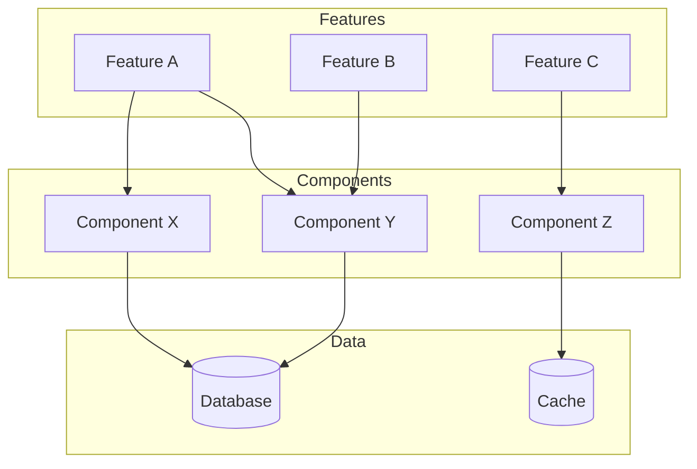

## Template 2: Architecture Decision Impact

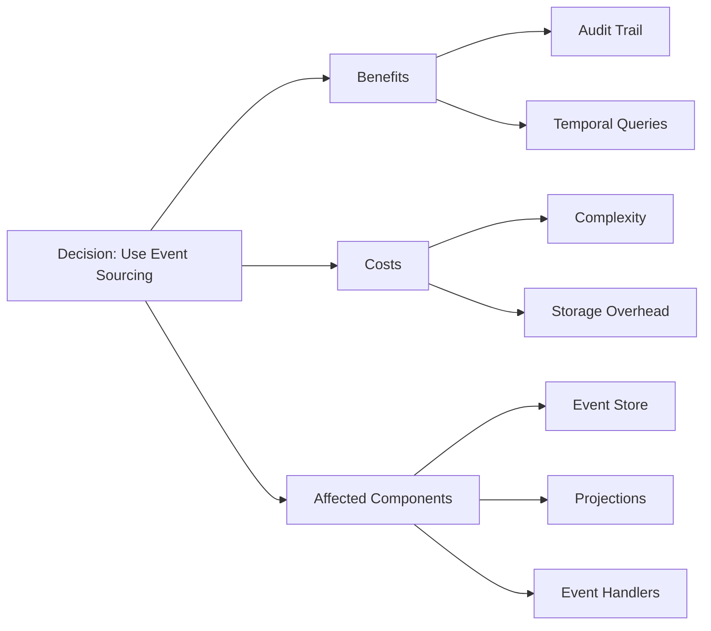

## Template 3: Module Relationships

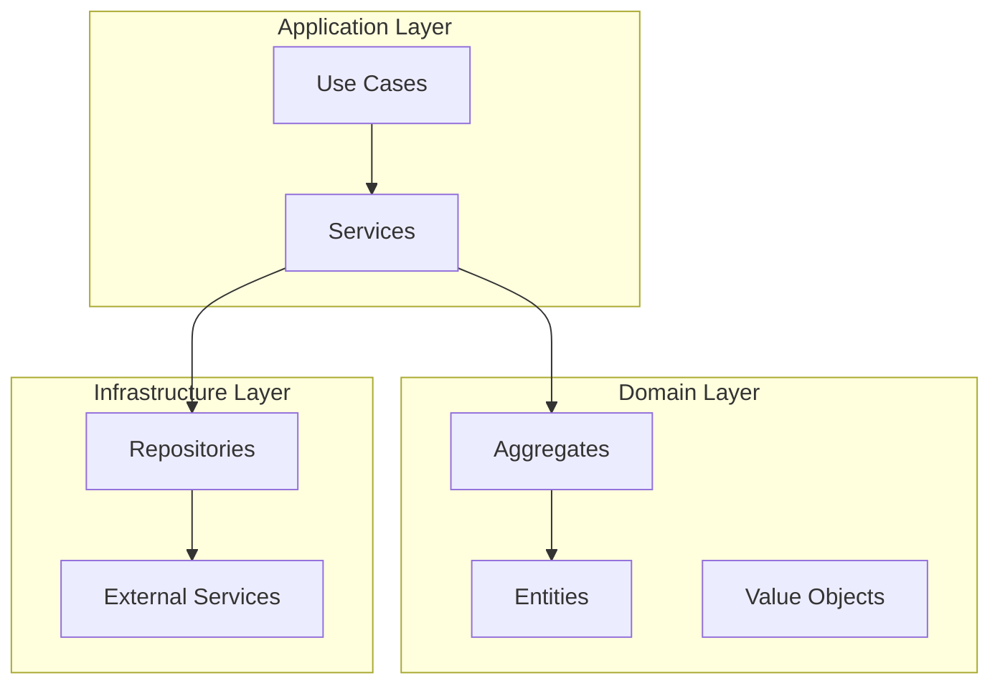

## Template 4: Data Flow

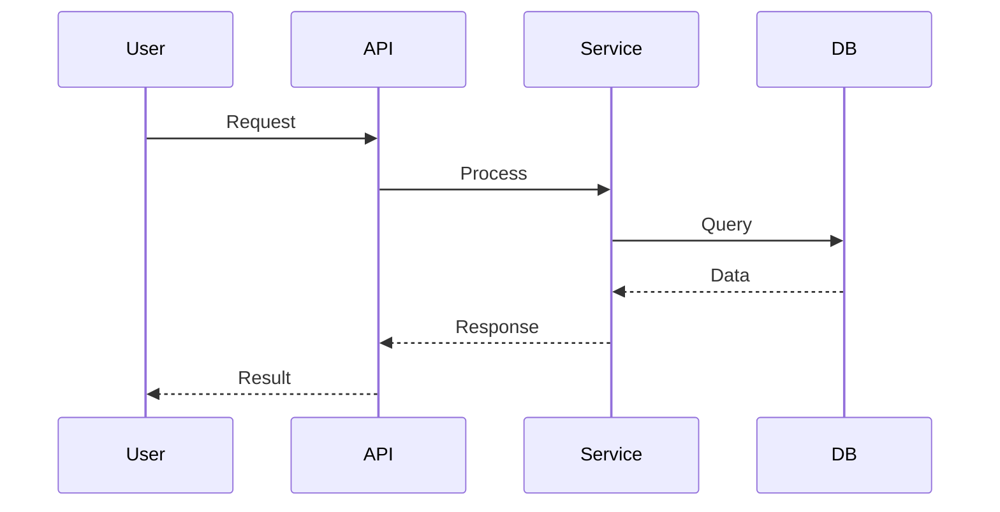

## Template 5: State Transitions

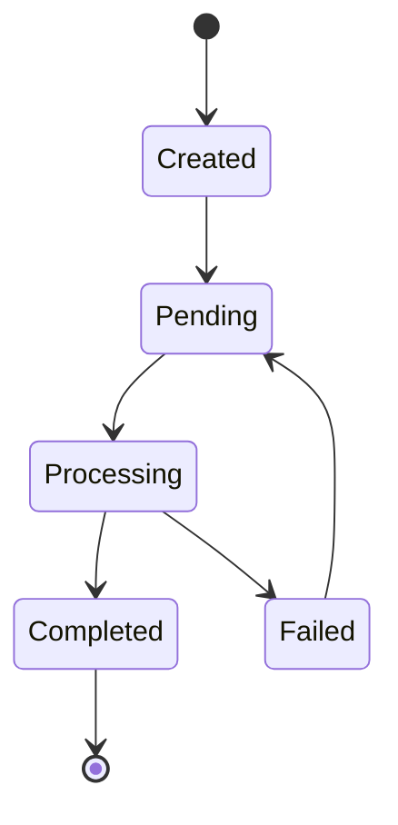

## Template 6: Component Hierarchy

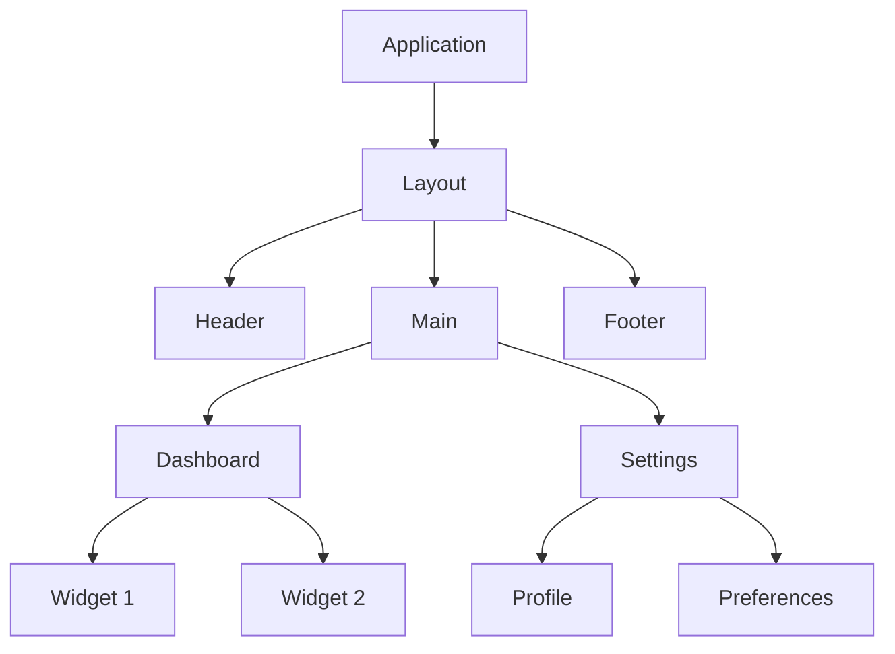

## Template 7: API Endpoint Relationships

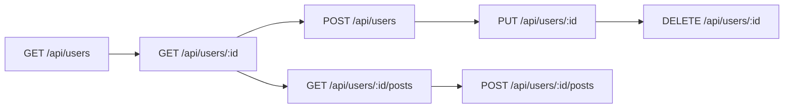

## Template 8: Technology Stack

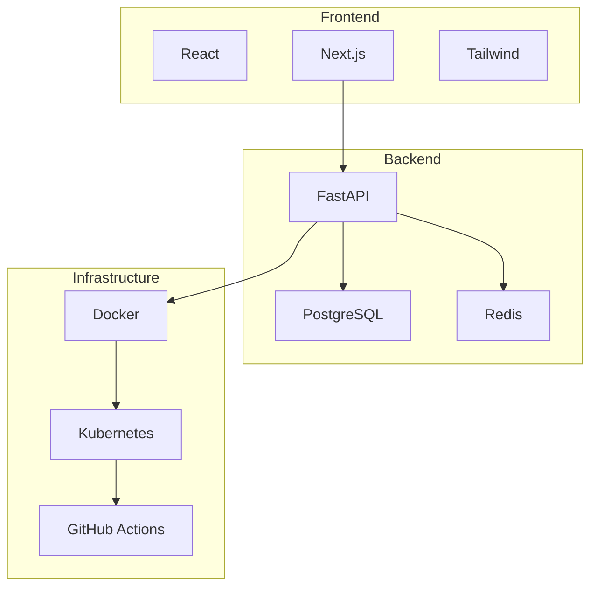

## Template 9: Risk Impact Analysis

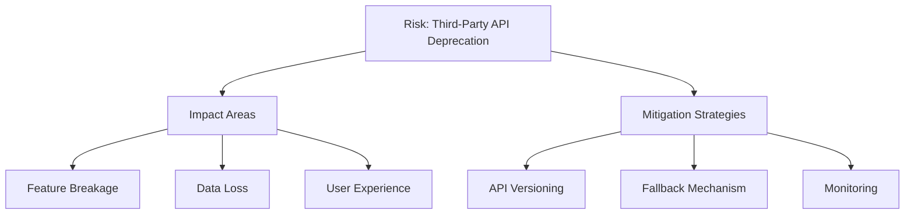

## Template 10: Knowledge Clusters

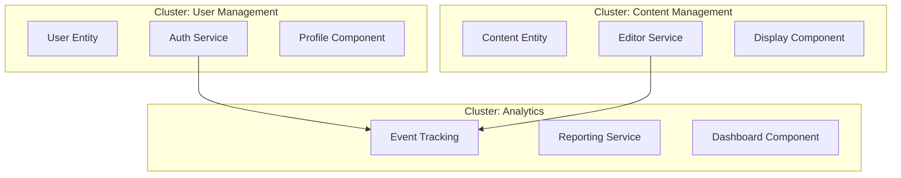

## Usage Guidelines

1. **Choose the right template** based on what you're mapping
2. **Customize nodes** with your specific entities
3. **Add relationships** that matter for your context
4. **Use subgraphs** to group related concepts
5. **Keep it simple** - don't overcomplicate

## Styling Tips

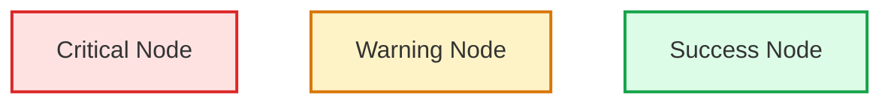

## Best Practices

1. **Consistent naming** - Use clear, descriptive names
2. **Logical grouping** - Group related items together
3. **Directional flow** - Show the direction of relationships
4. **Color coding** - Use colors to indicate importance or type
5. **Documentation** - Add notes for complex relationships