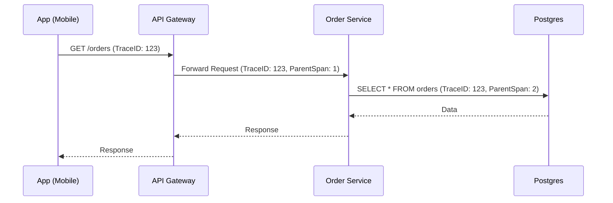

# Metrics & Tracing: The Vital Signs

Metrics and Tracing allow understanding system *performance* and *flow* in real-time.

---

## 1. Metrics (The "How Much")

Metrics are numerical aggregations over time.

### RED Pattern (For API Services)
- **R: Rate**: Number of requests per second.
- **E: Errors**: Number of requests that failed.
- **D: Duration**: Time requests took (Latency).

### USE Pattern (For Infrastructure)
- **U: Utilization**: Percentage of use (CPU, RAM).
- **S: Saturation**: Extra work queue.
- **E: Errors**: Hardware or operating system errors.

## 2. Distributed Tracing (The "Where")

Distributed tracing follows a request through multiple services.

- **Trace**: The complete journey of a request.
- **Span**: An individual operation within the trace (e.g., a SQL query, an external HTTP call).
- **Context Propagation**: The act of passing the `TraceID` in HTTP headers so the next service can continue the trail.

## 3. OpenTelemetry (OTel)

The 2026 market standard for telemetry.

### Components:
1.  **SDKs**: Libraries in the application to generate data.
2.  **Collector**: A proxy that receives, processes, and exports data to different backends.
3.  **Protocol (OTLP)**: The universal data sending format.

## 4. Visualization

- **Prometheus/Grafana**: The perfect pair for metrics.
- **Jaeger/Tempo**: Tools to visualize trace timelines.

---

## Context Propagation Example (Mermaid)




---

<!-- @sdd-state -->
```yaml
version: "2.3.0"
feature_id: "HUB-ALIGNMENT"
phase: "VERIFY"
status: "COMPLETED"
last_update: "2026-05-06T13:16:19.376705Z"
evidence_checksum: "NONE"
```
