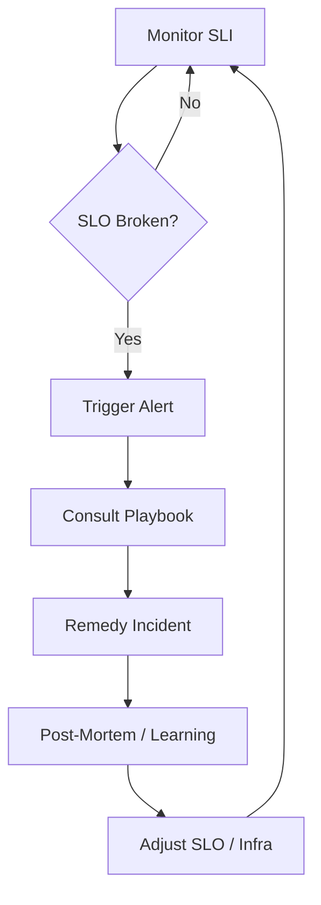

# SLIs, SLOs & Alerting: Reliability by Design

Reliability is not an accident; it is an engineering goal based on mathematical data and business agreements.

---

## 1. Fundamental Definitions

### SLI (Service Level Indicator)
It is what you measure. A specific technical metric that indicates the health of a component.
- **Example**: "Percentage of HTTP 200 requests in the last 24h".

### SLO (Service Level Objective)
It is the goal you want to reach for the SLI.
- **Example**: "99.9% of requests must return 200 status".

### SLA (Service Level Agreement)
The legal contract with the customer. If the SLA is broken, there are financial consequences. Generally, the SLO is more rigorous than the SLA to provide a safety margin.

## 2. Error Budget

The Error Budget is the difference between 100% and your SLO.
- **99.9% SLO** = 0.1% error budget.
- **Meaning**: You are allowed to fail or be down by this percentage without breaking your goal.
- **Usage**: Use the error budget to decide when to launch new features vs. when to focus on stability. If the budget is running out, stop releases and focus on fixes.

## 3. Alerting Policies

Avoid alert fatigue by following these rules:

1.  **Burn Rate Alerting**: Alert when the error budget is being consumed too fast (e.g., consumed 5% in 1h). This is more effective than momentary spike alerts.
2.  **Actionable Alerts**: Every alert must answer: "What does the human need to do now?". If there is no immediate action, it should be a backlog ticket, not an alert.
3.  **Severity Levels**:
    - **P1/Critical**: Wakes someone up (e.g., Payments down).
    - **P2/Warning**: Notifies on Slack during business hours.
    - **P3/Info**: Dashboards only.

## 4. Playbooks (Runbooks)

Each critical alert must have a link to an instruction document containing:
- Problem description.
- Diagnostic steps (log queries, dashboards).
- Remediation commands (e.g., how to do a rollback).

---

## Resilience Lifecycle (Mermaid)




---

<!-- @sdd-state -->
```yaml
version: "2.3.0"
feature_id: "HUB-ALIGNMENT"
phase: "VERIFY"
status: "COMPLETED"
last_update: "2026-05-06T13:16:19.376918Z"
evidence_checksum: "NONE"
```
