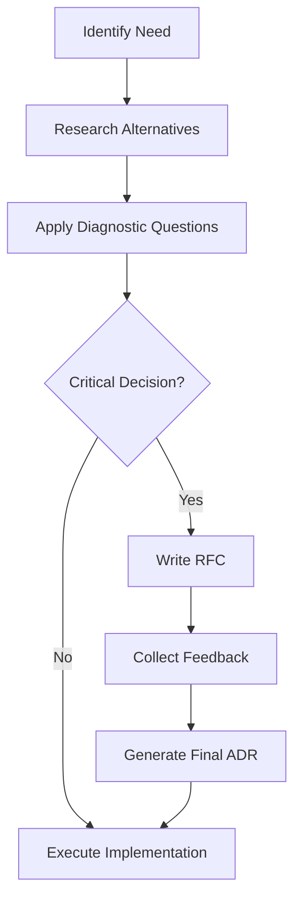

# Technical Decision Making Framework

This guide provides the roadmap for evaluating and documenting critical technical decisions in the project, ensuring that the culture of simplicity and rigor is maintained.

---

## 1. When Does a Decision Require Formalization?
A decision must be documented via **RFC (Request for Comments)** or **ADR (Architecture Decision Record)** when:
- It introduces a new technology or library.
- It changes the fundamental structure of the system (e.g., switching from REST to GraphQL).
- It impacts multiple teams or modules.
- It defines a new coding or security standard.

## 2. Diagnostic Questions (Skynet Culture)
Before deciding, answer:
1.  **Scalability**: Does this solution support the expected increase in load? (Consult the `architecture` skill).
2.  **Maintenance**: Who will take care of this in 6 months? Is it a mainstream technology or something obscure?
3.  **Simplicity (KISS)**: Is there a way to do this without adding a new dependency?
4.  **Cost**: What is the impact on the infrastructure budget or development time?
5.  **Reversibility**: If we discover this was a wrong choice, how difficult is it to go back?

## 3. The Decision Process

## 4. ADR (Architecture Decision Record) Structure
Use the official template in the `.specs/architecture/` folder:
- **Status**: Proposed, Accepted, Superceded.
- **Context**: The problem we are trying to solve.
- **Decision**: The chosen solution.
- **Consequences**: The trade-offs (positive and negative) of the choice.

## 5. Mentor's Tip
"Don't choose the technology you want to learn, choose the technology the project needs to survive." — Prioritize stability and the ease of hiring new talent.
