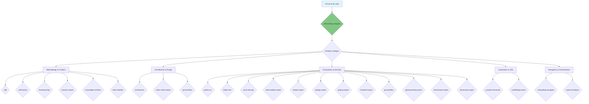
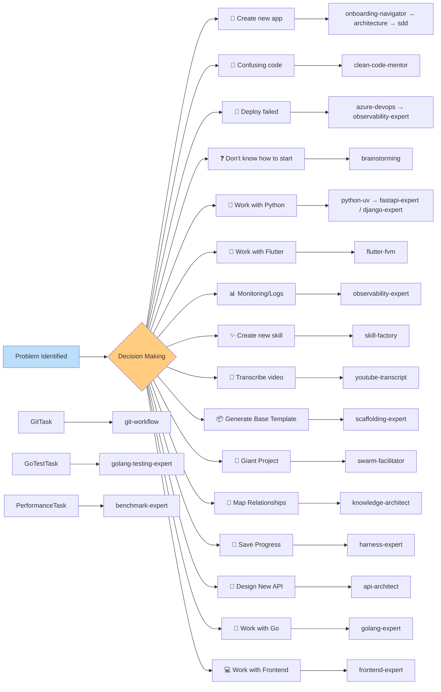

# Skills Catalog: AI Agent Hub

This guide provides a detailed overview of all 25 abilities available in this repository, serving as a compass for the Onboarding Navigator.

## 🗺️ Visual Map of the Skills Ecosystem

---

## 📚 Complete Skills Catalog (25 Total)

### 1. 🏗️ Core Frameworks (Methodology and Creation)

| Skill | Version | Purpose | When to Invoke |
|-------|--------|-----------|------------------|
| **[SDD](../../sdd/)** | `1.5.0` | Spec-Driven Development. Modular workflow with PRD/RFC, BDD, and Mermaid Diagrams mandate. | **Always** when starting an implementation. |
| **[Skill Factory](../../skill-factory/)** | `1.1.0` | Core Framework for standardized creation of new skills with automated scaffolding, validation, and registration. | When creating or auditing an ability in the hub. |
| **[Brainstorming](../../brainstorming/)** | `1.1.0` | Brainstorming and Design Facilitator — guides the agent to explore complex problems. | Before any technical specification. |
| **[Harness Expert](../../harness-expert/)** | `2.0.0` | Technical engine for Harness Engineering (Sync, Rehydrate, Automation). | When technical support from the agentic engine is needed. |
| **[Knowledge Architect](../../knowledge-architect/)** | `1.0.0` | Local knowledge architecture via relational graphs (Local GraphRAG). | To map complex relationships. |
| **[Token Distiller](../../token-distiller/)** | `1.0.0` | Token density manager and compression modes (Caveman/Premium). | To optimize token consumption in long tasks. |

### 2. 🎨 Architecture & Design (Quality and Structure)

| Skill | Version | Purpose | When to Invoke |
|-------|--------|-----------|------------------|
| **[Architecture](../../architecture/)** | `2.0.1` | Systems Architect — designs scalable, resilient, and distributed systems via ADRs. | When designing a system's macro structure. |
| **[Clean Code Mentor](../../clean-code-mentor/)** | `1.0.0` | Technical mentoring and code review focused on SOLID, YAGNI, DRY, and KISS. | During code reviews or refactorings. |
| **[API Architect](../../api-architect/)** | `1.3.0` | API Architect — designs interoperable and secure systems. | When designing endpoints and integrations. |

### 3. ⚙️ Ecosystems & DevOps (Environments and Automation)

| Skill | Version | Purpose | When to Invoke |
|-------|--------|-----------|------------------|
| **[Python with UV](../../python-uv/)** | `3.0.0` | Professional Python development with UV. | In macro tasks involving Python. |
| **[FastAPI Expert](../../fastapi-expert/)** | `1.1.0` | Advanced asynchronous API development with FastAPI and Pydantic. | When coding FastAPI routes and schemas. |
| **[Django Expert](../../django-expert/)** | `1.5.0` | Robust development with Django, focused on architecture, security, and TDD. | When working with Django applications. |
| **[Flutter with FVM](../../flutter-fvm/)** | `1.3.0` | Professional Flutter development with FVM (Dart 3+, A11y, Performance). | In any task involving Flutter/Dart. |
| **[Azure DevOps](../../azure-devops/)** | `1.1.0` | Professional Azure DevOps (AzDO) management. | To manage tasks and CI/CD in AzDO. |
| **[Observability Expert](../../observability-expert/)** | `1.0.0` | SRE and Observability specialist (OTel, Structured Logs). | When ensuring a system is monitorable. |
| **[Golang Expert](../../golang-expert/)** | `1.1.0` | Go Excellence — Performance, idiomatic concurrency, and Samber ecosystem. | When developing high-performance systems in Go. |
| **[Frontend Expert](../../frontend-expert/)** | `1.1.0` | Expert in modern interfaces with React, Next.js, and TailwindCSS v4. | When designing or implementing modern UIs. |
| **[Git Workflow](../../git-workflow/)** | `1.0.0` | Git workflow patterns, branching strategies, and SDD integration. | When performing commits, opening PRs, or managing branches. |
| **[Golang Testing Expert](../../golang-testing-expert/)** | `1.0.0` | QA expert for Go — TDD, Table-Driven Tests, Benchmarks, and Fuzzing. | When implementing Go test suites. |
| **[Benchmark Expert](../../benchmark-expert/)** | `1.0.0` | Expert Skill for performance baseline measurement, regression detection, and stack comparison. | When validating performance impact of changes or PRs. |
| **[DevSecOps Expert](../../devsecops-expert/)** | `1.0.0` | Static quality auditing, SAST/DAST security, and Hardening. | When performing security and quality audits on code. |

### 4. 🚀 Automation & Utils (Productivity)

| Skill | Version | Purpose | When to Invoke |
|-------|--------|-----------|------------------|
| **[YouTube Transcript](../../youtube-transcript/)** | `1.0.0` | Automate YouTube video transcript extraction. | When video content is needed. |
| **[Scaffolding Expert](../../scaffolding-expert/)** | `1.0.0` | Dynamic template generation via CLI (copier/cookiecutter). | To generate a new project from scratch. |

### 5. 🧭 Navigation & Orchestration

| Skill | Version | Purpose | When to Invoke |
|-------|--------|-----------|------------------|
| **[Onboarding Navigator](../../onboarding-navigator/)** | `1.2.1` | Skills Hub master guide. Provides overview and mentorship. | **At session start** to understand the hub. |
| **[Swarm Facilitator](../../swarm-facilitator/)** | `1.1.0` | Agent team choreography (Architect, Dev, QA) and handoff protocols. | In large epics requiring multiple coordinated agents. |

---

## 🧠 Decision Matrix: Which Skill to use?

---

## 📈 Hub Statistics

- **Total Skills**: 25
- **Methodology Skills**: 6
- **Architecture Skills**: 3  
- **DevOps/Framework Skills**: 12
- **Automation Skills**: 2
- **Navigation/Orchestration Skills**: 2
- **Last Update**: April 23, 2026
