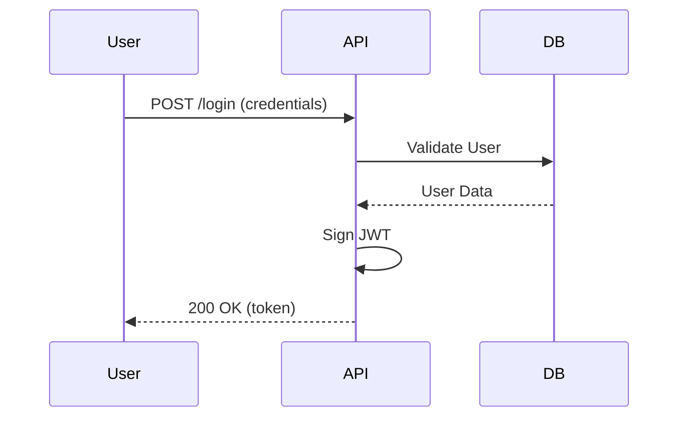

# Gold Standard Output: SDD Execution (Multi-File)

## 1. Requirements (spec.md)
The agent generated a clear specification focusing on behavior:

```markdown
### AC-1: Token Generation
**Given** that the user provides valid credentials
**When** the /login route is called
**Then** a JWT token must be returned with 1h expiration.
```

## 2. Technical Design (plan.md)
The plan includes a Mermaid sequence diagram and schema definitions:



## 3. Atomic Tasks (tasks.md)
Broken down into implementable chunks:

```markdown
- [x] Create Auth Service with JWT signing logic.
- [ ] Implement /login route and controller.
- [ ] Add integration tests for success/fail login scenarios.
```

## 4. Rationale
This output is Gold Standard because:
- **Separation of Concerns**: Spec defines "What", Plan defines "How", Tasks define "When".
- **BDD-First**: Acceptance criteria are readable and testable.
- **Traceability**: Each task maps back to an AC in the spec.
- **Visual Evidence**: Uses Mermaid to prevent architectural hallucinations.
