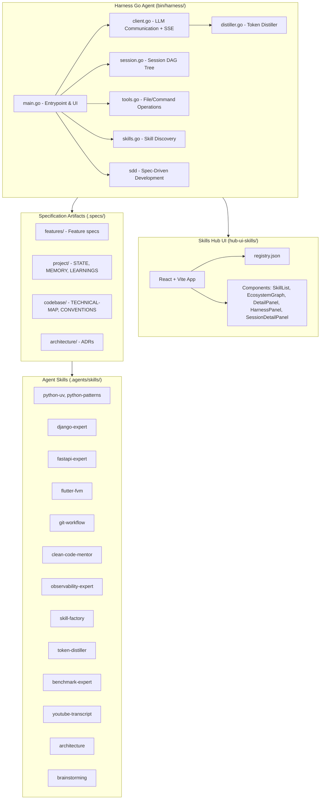

# Technical Map — Skills Hub Ecosystem

## Stack Overview



## Key Dependencies

| Component | Language | Build | Dependencies |
|-----------|----------|-------|--------------|
| Harness Agent | Go 1.26.1 | `go build` | Standard library only (zero external deps) |
| Hub UI | React 19 + Vite 8 | `npm run build` | @xyflow/react, react-markdown |
| Skills | Markdown | - | None |

## Current Integration Points for MCP

The Harness Agent currently:
1. **LLM Communication**: Via `client.go` — direct HTTP REST calls to Gemini/Ollama/DeepSeek APIs
2. **Tool Execution**: Via `tools.go` — read_file, write_file, patch_file, search_files, execute_command
3. **Session Management**: Via `session.go` — DAG-based session tree with branching
4. **Skills Discovery**: Via `skills.go` — scans workspace for SKILL.md files
5. **SDD Filtering**: Via `sdd.go` — governance checks before write operations

## MCP Integration Opportunity

MCP (Model Context Protocol) is an open protocol by Anthropic that standardizes how LLMs interact with tools and data sources. Integrating MCP would:

1. Replace/Supplement direct REST calls with standardized MCP tool definitions
2. Enable the Harness Agent to expose its tools (read_file, write_file, etc.) as MCP tools
3. Allow the Harness Agent to act as both an MCP **client** (connecting to external MCP servers) and an MCP **server** (exposing its own capabilities)
4. Provide a standardized context format for tool inputs/outputs

---

<!-- @sdd-state -->
```yaml
version: "2.3.0"
feature_id: "mcp-integration"
phase: "DISCOVERY"
status: "IN_PROGRESS"
last_update: "2026-05-23T16:20:00Z"
evidence_checksum: "discovery-map"
```
