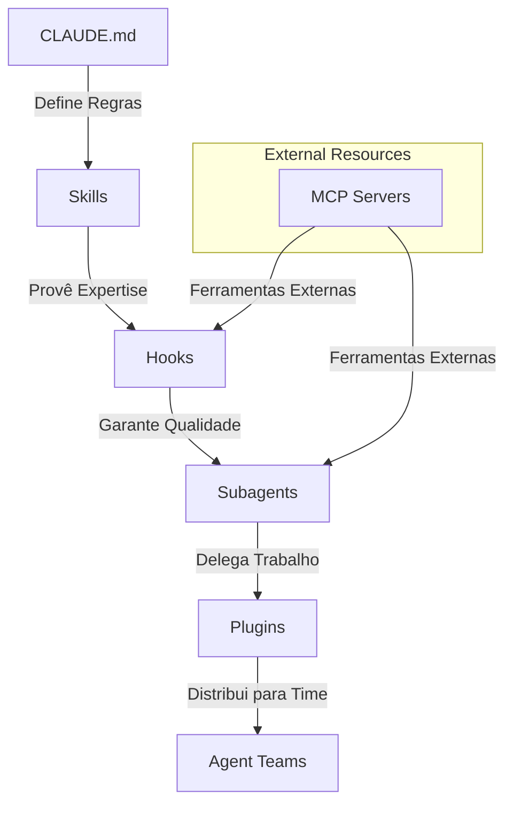

# Plan: ADK Expert Skill

## Architecture Overview
The `adk-expert` skill will be a structured markdown file (`SKILL.md`) that codifies the Agent Development Kit principles. It will act as a reference for the agent to follow when designing agentic architectures.

## Proposed Structure (`SKILL.md`)
1. **Frontmatter**: metadata (name, version, etc.)
2. **Introduction**: High-level overview of the 5-layer model.
3. **Layer Details**:
   - **Camada 1: Memória (CLAUDE.md)**: Details on establishing the agent's "constitution".
   - **Camada 2: Conhecimento (Skills)**: Modular context chunks.
   - **Camada 3: Guardrails (Hooks)**: Deterministic quality controls.
   - **Camada 4: Delegação (Subagents)**: Context isolation strategies.
   - **Camada 5: Distribuição (Plugins)**: Reusability and ecosystem.
4. **Integration**: MCP Servers and Agent Teams.

## Mermaid Diagram (Flow)

## Implementation Steps
1. Create `adk-expert/` directory.
2. Write `adk-expert/SKILL.md` with Brazilian Portuguese content.
3. Add a section about "The Law of SDD" to align with current project governance.
4. Verify consistency with the provided image.

## Verification Sensors
- `test_skill_exists`: Check if file exists at `adk-expert/SKILL.md`.
- `test_content_integrity`: Verify if all 5 layers are present.
- `test_language`: Verify Brazilian Portuguese usage.
