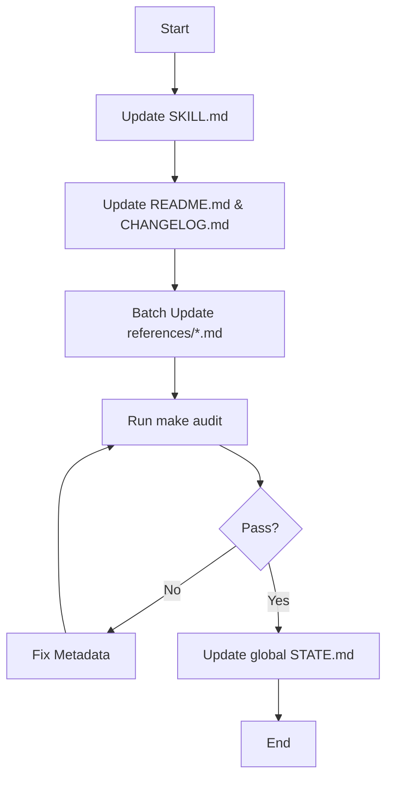

# Plan: Align Python UV Skill to SDD v2.3.0

## Proposed Changes

### 1. Metadata Injection
Every `.md` file in `python-uv/` and its subdirectories will receive the following metadata block at the end:

```markdown
<!-- @sdd-state -->
```yaml
version: "2.3.0"
feature_id: "python-uv-alignment"
phase: "VERIFY"
status: "COMPLETED"
last_update: "2026-05-06T10:11:45Z"
evidence_checksum: "NONE"
```
```

### 2. Version Alignment
The frontmatter `version` in `python-uv/SKILL.md` will remain as its functional version (e.g., 4.0.0), but the SDD metadata block will specify the governance version (2.3.0).

### 3. Workflow



## Risks & Mitigations
- **Risk**: Automated tools might overwrite custom metadata.
- **Mitigation**: Ensure `<!-- @sdd-state -->` tag is unique and positioned correctly at the end of files.

---

<!-- @sdd-state -->
```yaml
version: "2.3.0"
feature_id: "python-uv-alignment"
phase: "SPECIFY"
status: "IN_PROGRESS"
last_update: "2026-05-06T10:11:45Z"
evidence_checksum: "NONE"
```
