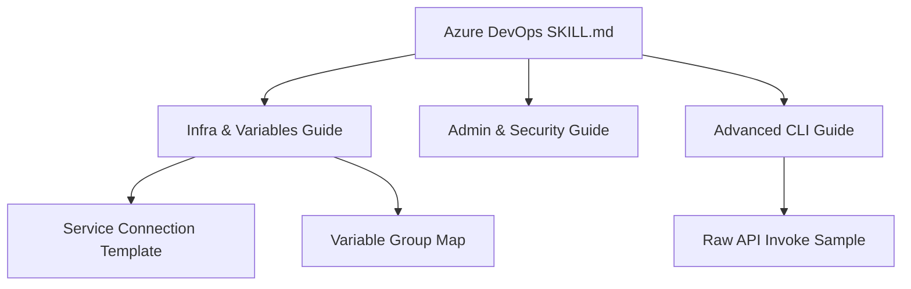

# Plan: Azure DevOps Skill v1.1.0 Upgrade

## Infrastructure Overview (Mermaid)

## Phase 1: Preparation (Done)
- [x] Analyze `github/azure-devops-cli` for advanced capabilities.
- [x] Define `spec.md` with BDD scenarios for Governance/IaC support.

## Phase 2: Core Skill Update
- [ ] Update `azure-devops/CHANGELOG.md` (Version 1.1.0).
- [ ] Update `azure-devops/SKILL.md` (Add Governance phase and Quality Rules).

## Phase 3: Reference Guides Update
- [ ] Create `azure-devops/references/infrastructure-and-variables.md`.
- [ ] Create `azure-devops/references/administration-and-security.md`.
- [ ] Create `azure-devops/references/advanced-cli-commands.md`.

## Phase 4: Examples & Resources
- [ ] Create `azure-devops/examples/service-connection-template.json`.
- [ ] Create `azure-devops/examples/variable-group-mapping.mermaid`.
- [ ] Create `azure-devops/examples/raw-api-invoke-sample.sh`.

## Phase 5: Final Review & Persistence (MANDATORY TASK UPDATE)
- [ ] Perform `skill-factory-validator` audit.
- [ ] Update root `README.md` to version 1.1.0.
- [ ] **Proactively update `tasks.md` to 100% completion.**
- [ ] Update project specs and roadmap.
