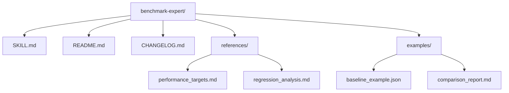

# Plan: Benchmark Expert Skill

## 1. Arquitetura da Skill
A skill será estruturada seguindo o padrão "Expert" do Hub, focando em densidade de contexto e guias acionáveis.

## 2. Estrutura de Dados (Baselines)
Os baselines serão salvos em `.benchmarks/` na raiz do projeto (ou no diretório da skill se preferível, mas baselines de projeto devem ser globais).
Formato: `baseline-<timestamp>-<branch>.json`

## 3. Implementação dos Modos
### Mode 1: Browser Metrics
- Uso das ferramentas de navegação e medição de performance do browser.
- Foco em Core Web Vitals.

### Mode 2: API Benchmarking
- Uso de `curl` ou scripts Node/Python para requisições concorrentes.
- Cálculo de percentis (p50, p95, p99).

### Mode 3: Build & Tooling
- Medição de tempo de comandos (`time npm run build`).
- Scripts para medir latência de HMR.

## 4. Estratégia de Validação
- Executar `skill-factory-validator` para garantir conformidade de metadados e hooks SDD.
- Auditoria manual de tradução e tom de voz (Expert/Professional).

## 5. Próximos Passos (Workflow)
1. Bootstrap via `skill-factory`.
2. Escrita do `SKILL.md` (Tradução e Enriquecimento).
3. Criação dos arquivos de referência (`references/`).
4. Registro no `README.md` raiz.
