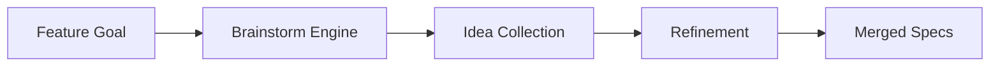

# Technical Plan: Brainstorming Enrichment

## Architecture
1. **Idea Generator**: Logic to prompt the agent for creative alternatives based on feature goals.
2. **Context Injector**: Merges brainstorming results into `PROJECT.md` or dedicated `brainstorm/` folders.
3. **Validation Filter**: Heuristics to discard low-quality ideas.

## Mermaid Diagram

