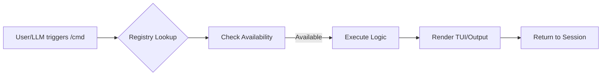

# Plan: New Skill - CLI Expert

## 1. Architecture
The skill will be located in `/cli-expert`. It will follow the standard Hub structure: `SKILL.md`, `CHANGELOG.md`, `MEMORY.md`, `LEARNINGS.md`, `tasks.md`.

## 2. Technical Baseline (Mined from `src`)
- **Command Kinds**: `Prompt`, `Local`, `Bundled`, `MCP`, `Internal`.
- **Metadata**: `id`, `kind`, `description`, `userDescription`, `prompt`, `parameters`.
- **UI Paradigm**: Terminal React (Ink) for streaming and interactivity.

## 3. Implementation Steps
1.  **Scaffold**: Use `mkdir` and create basic files (or use a script if available).
2.  **Write `SKILL.md`**: Detailed instructions on CLI design patterns.
3.  **Audit**: `hb audit cli-expert`.
4.  **Register**: Update `README.md` and `onboarding-navigator` (via `hb map`).

## 4. Mermaid Diagram (Command Lifecycle)

