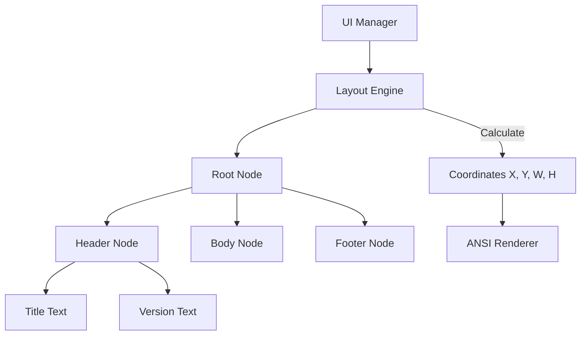

# Plan: CLI Flexbox Layout (Yoga-inspired)

## 1. Architecture

We will implement a hierarchical layout system in `hb/internal/ui/layout`.

### Core Components:
- **`Node`**: The fundamental unit of layout. Holds style properties (FlexDirection, JustifyContent, AlignItems, Padding, Margin) and children.
- **`LayoutEngine`**: Responsible for the recursive calculation of coordinates (X, Y) and dimensions (Width, Height) for each Node.
- **`Renderer`**: Bridges the layout coordinates with ANSI output.

### Mermaid Diagram:


## 2. Implementation Strategy

### Phase 1: Core Layout Engine
- Create `Node` struct in `hb/internal/ui/layout/node.go`.
- Implement a simplified version of the Yoga algorithm (Flexbox solver) that handles character-based units.

### Phase 2: Style Definitions
- Define enums for `FlexDirection`, `JustifyContent`, `AlignItems`.
- Add support for basic properties: `FlexGrow`, `FlexShrink`, `FlexBasis`.

### Phase 3: Integration with UI Manager
- Update `hb/internal/ui/manager.go` to use the layout engine.
- Implement a "Virtual Screen" buffer that gets filled based on layout coordinates before being flushed to stdout.

## 3. Data Schemas

```go
type Node struct {
    Style    Style
    Children []*Node
    Result   LayoutResult
}

type Style struct {
    FlexDirection  FlexDirection
    JustifyContent JustifyContent
    AlignItems     AlignItems
    Margin         EdgeValues
    Padding        EdgeValues
    Width, Height  int // Characters
}

type LayoutResult struct {
    Left, Top     int
    Width, Height int
}
```

## 4. Risks & Mitigations
- **Complexity of Flexbox Solver**: Implementing a full Yoga-compliant solver is hard. 
  - *Mitigation:* Focus on the 80% use case (Row/Column, SpaceBetween, Center) first.
- **Performance**: Recalculating on every frame might be slow.
  - *Mitigation:* Only recalculate on terminal resize or when the layout tree changes.
