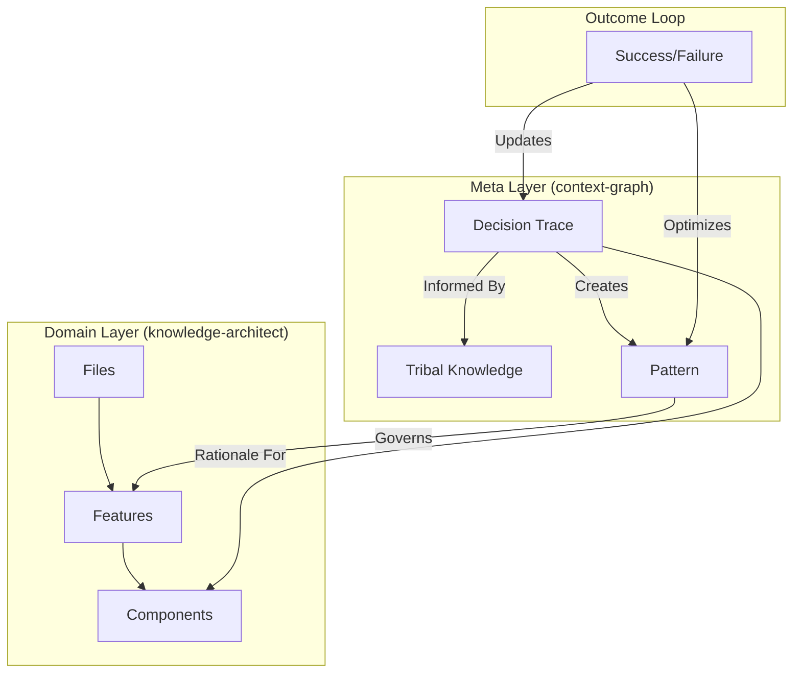

# Implementation Plan: Context Graph Skill

## Architecture Overview

The Context Graph operates as a Meta-Layer above the Domain Knowledge Graph. It utilizes the **Triad of Memory** (State, Memory, Learnings) but adds a structured **Graph Logic** to relationships.

## Proposed File Structure

- `context-graph/`
  - `SKILL.md`: Core logic and rules.
  - `README.md`: Entry point and versioning.
  - `MEMORY.md`: Persistent state.
  - `LEARNINGS.md`: Historical insights.
  - `CHANGELOG.md`: Version tracking.
  - `tasks.md`: SDD-aligned task list.
  - `examples/`: Gold standard Decision Ledgers.
  - `references/`: Article summaries.
  - `resources/`: Mermaid diagrams and assets.

## Implementation Steps

1. **Bootstrap**: Create directory and SDD artifacts (Completed Retroactively).
2. **Authoring**: Write `SKILL.md` incorporating Episodic/Semantic/Procedural memory concepts.
3. **Refinement**: Add "Quality Rules" for Outcome Tracking and Rationale validation.
4. **Resources**: Generate visual assets in `resources/` for better understanding.
5. **Validation**: Run compliance checks.

## Risk Assessment
- **Risk**: Agents might over-log trivial decisions, bloating the Context Graph.
- **Mitigation**: Quality Rule "KISS Graphing" (Focus on architectural components, not trivial details).
