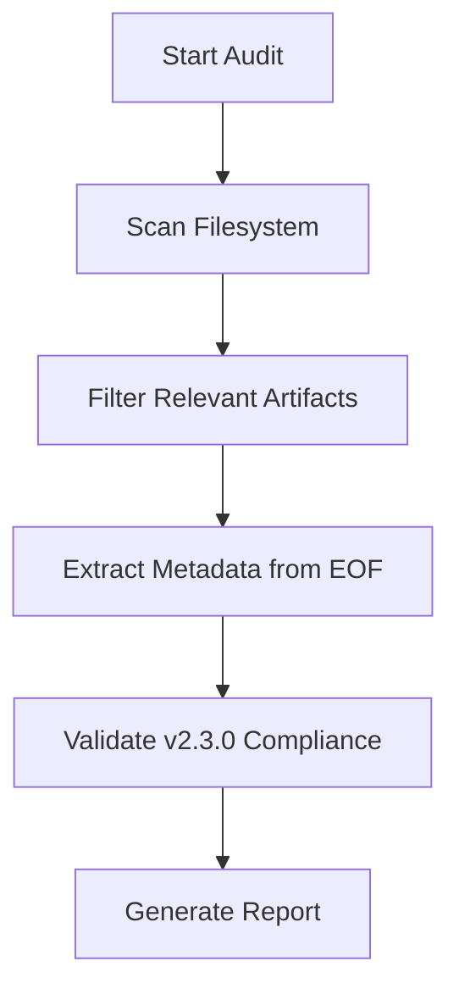

# Technical Plan: Dynamic Health Check

## 🏗️ Architecture
The audit script will be refactored from a hardcoded list to a discovery-based system.

### Refactoring Strategy
1.  **Discovery Engine**:
    *   Walk through the filesystem.
    *   Exclude: `.git`, `bin`, `examples`, `resources`, `node_modules`.
    *   Collect: Root `.md` files, `.specs/project/*.md`, and all `SKILL.md`, `README.md`, `CHANGELOG.md` in skill directories.
2.  **Metadata Extraction Hardening**:
    *   Update regex to find blocks that are NOT nested inside other markdown elements if possible, or simply pick the absolute last occurrence and validate it's not a template.
    *   Alternative: Only parse blocks that are at the very end of the file.
3.  **Governance Sweep**:
    *   Add missing metadata to core files (like `sdd/SKILL.md`).

## 📊 Flow



---

<!-- @sdd-state -->
```yaml
version: "2.3.0"
feature_id: "DYNAMIC-HEALTH-CHECK"
phase: "SPECIFY"
status: "IN_PROGRESS"
last_update: "2026-05-06T10:12:00Z"
evidence_checksum: "NONE"
```
