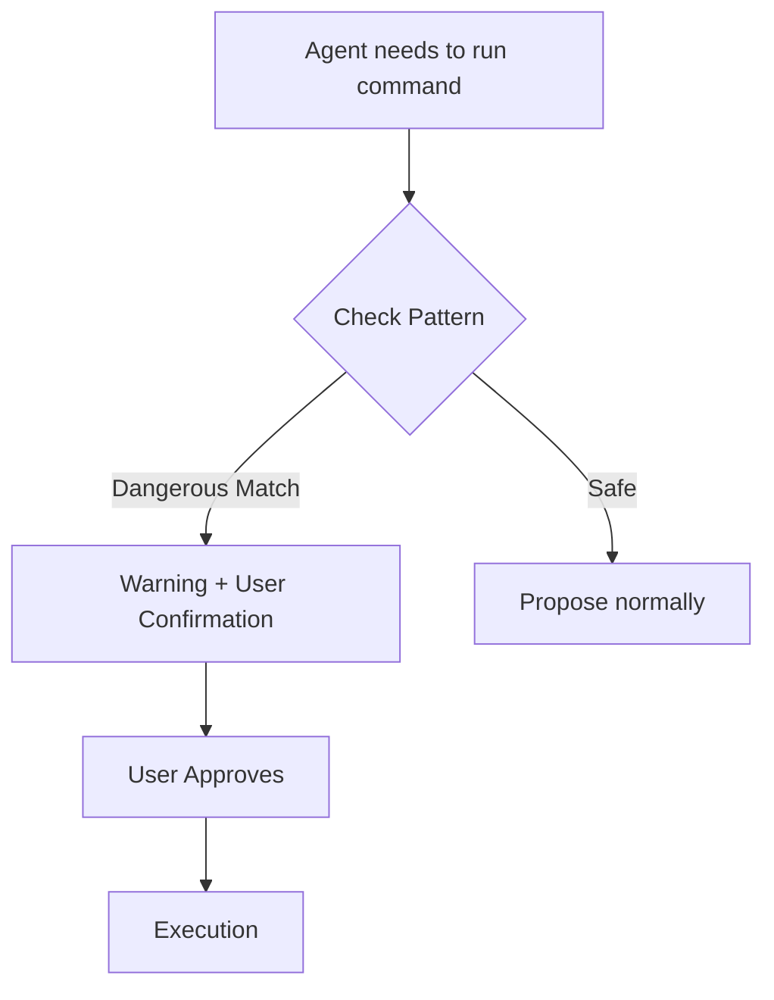

# Plan: Enrichment of DevSecOps Expert

## 1. Architecture
This is a documental enrichment task. The `devsecops-expert/SKILL.md` will be updated to include a new section on Agentic Safety.

## 2. Guardrails Registry (Technical Baseline)
The following patterns will be injected into the skill:

### Cross-Platform Execution
- Interpreters: `python`, `node`, `deno`, `tsx`, `ruby`, `perl`, `php`, `lua`.
- Package Runners: `npx`, `bunx`, `npm run`, `yarn run`, etc.
- Shells/Remote: `bash`, `sh`, `ssh`.

### Dangerous Bash/Shell Patterns
- Operations: `eval`, `exec`, `env`, `xargs`, `sudo`.
- Tools with side effects: `gh api`, `curl`, `wget`, `git`, `kubectl`, `aws`, `gcloud`, `gsutil`.

## 3. Implementation Steps
1.  **Update `SKILL.md`**: Add "Agentic Safety & Guardrails" section.
2.  **Update `CHANGELOG.md`**: Record the v1.1.0 changes.
3.  **Audit**: Run `hb audit` to ensure compliance.

## 4. Mermaid Diagram (Operational Flow)

