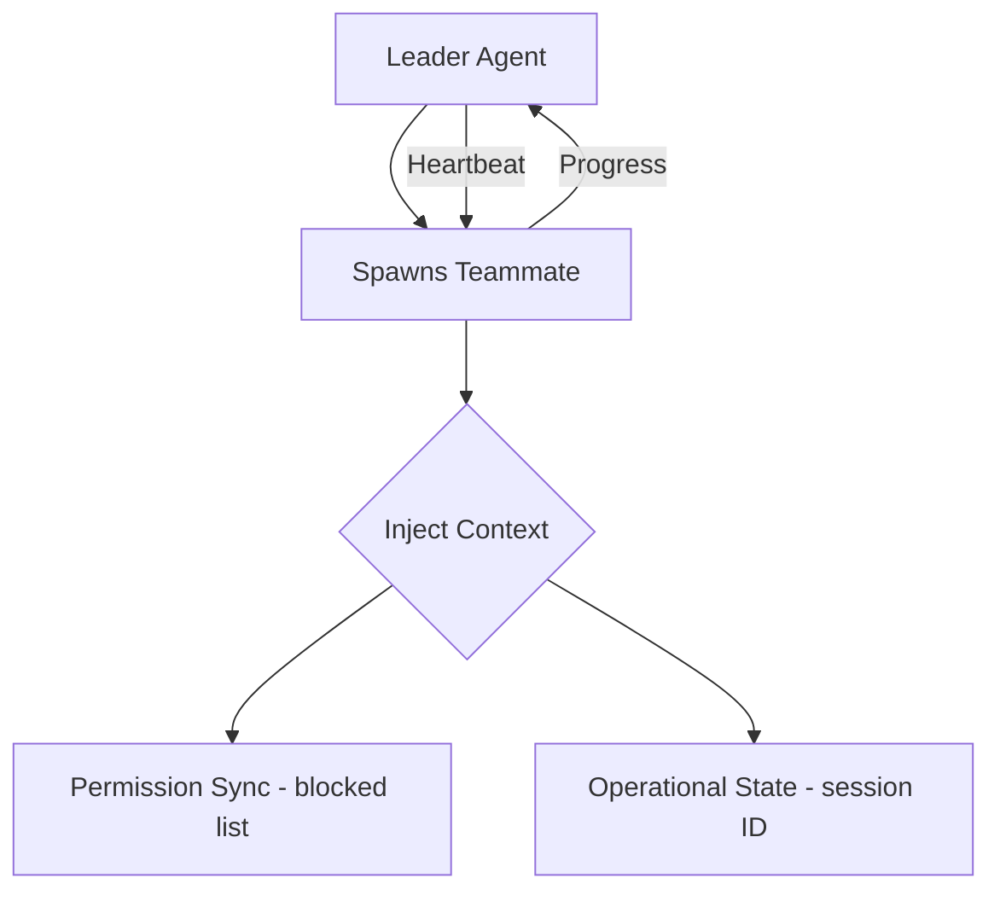

# Plan: Enrichment of Swarm Facilitator

## 1. Architecture
Enrich `swarm-facilitator/SKILL.md` by adding a "Technical Governance & Synchronization" section.

## 2. Technical Baseline (Mined from `src`)
- **Permission Bridge**: Leader shares `DANGEROUS_BASH_PATTERNS` with teammates via environment variables or init prompts.
- **Backends**:
  - `ITerm2`: Native macOS terminal integration for visual debugging.
  - `Tmux`: Cross-platform headless swarm management.
  - `InProcess`: High-speed, shared-memory teammates for trivial sub-tasks.
- **Resilience**: Reconnection logic based on session IDs.

## 3. Implementation Steps
1.  **Enrich `SKILL.md`**: Add "Multi-Agent Governance & Backends" section.
2.  **Update `CHANGELOG.md`**: Record v1.2.0.
3.  **Audit**: `hb audit swarm-facilitator`.
4.  **Finalize**: Update `STATE.md`.

## 4. Mermaid Diagram (Governance Sync)

