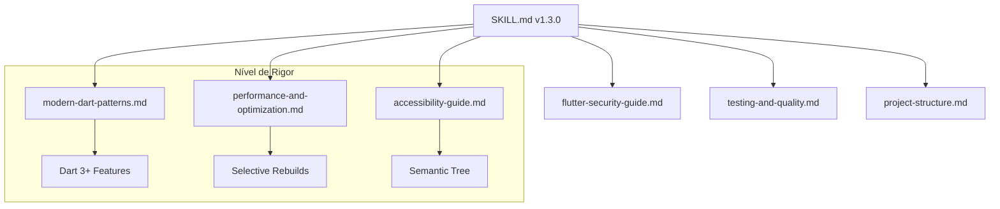

# Technical Plan: Flutter FVM Skill Enrichment

## Architectural Overview
O enriquecimento da skill visa transformar um guia de ambiente em um framework de excelência técnica.

### Dependency Graph (Mermaid)

## Phase 1: Core Skill Update
- **Arquivo**: `flutter-fvm/SKILL.md`
- **Mudança**: Inclusão de pilares Modern Dart, Performance, Acessibilidade e Resiliência.
- **Workflow**: Atualizar fases 2, 3 e 4 com os novos hooks técnicos.

## Phase 2: Documentation Strategy
Cada novo arquivo de referência deve seguir o padrão:
1. **Conceito**: Por que isso importa?
2. **Code Snippets**: Exemplo "Ruim" vs "Bom".
3. **Checklist**: Critérios rápidos para revisão.

## Phase 3: Validation Protocol
Para validar se o enriquecimento foi eficaz, realizaremos um "Dry Run" mental:
- "Se eu pedir para criar uma tela de login, a IA vai usar sealed classes para os estados?" -> **Sim**, via AC 1.
- "A IA vai lembrar de colocar semanticLabel no ícone de voltar?" -> **Sim**, via AC 2.

## Rollback Plan
Em caso de erro estrutural, restaurar o backup de `SKILL.md` v1.2.0 e remover os arquivos novos em `references/`.
