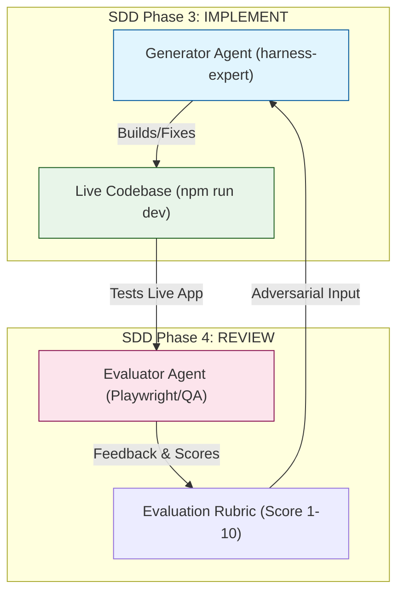

# Technical Plan: GAN-style Harness Integration

## 🏗️ Arquitetura do Sistema

O loop GAN será integrado como uma extensão da governança de qualidade.

## 🛠️ Alterações por Skill

### 1. `harness-expert/SKILL.md`
- **Adição**: Nova seção `## 🔄 GAN-style Feedback Loop`.
- **Conteúdo**: Explicação do papel do Generator vs Evaluator.
- **Rubrica**: Tabela de pontuação (Design, Craft, Originality, Functionality).
- **Workflow**: Atualizar as 4 fases para incluir "Phase 2.5: Feedback Iteration".

### 2. `sdd/SKILL.md`
- **Atualização**: Na `Fase 4: REVIEW`, adicionar nota sobre o uso do loop GAN para tarefas de alta complexidade.
- **Badge**: Adicionar menção ao GAN no `KNOWLEDGE-MAP.mermaid` (opcional, mas bom para visibilidade).

### 3. `onboarding-navigator/SKILL.md`
- **Atualização**: Adicionar o GAN-Harness como uma estratégia recomendada na "Matriz de Decisão" para projetos de alta fidelidade visual.

## 📋 Sensores de Validação (Contract)
- Presença da rubrica GAN na skill `harness-expert`.
- Link explícito entre `sdd` e `harness-expert` para o loop de feedback.
- Passagem com sucesso no script `validate_skills.py`.

---
*Plano técnico aprovado via SDD.*
