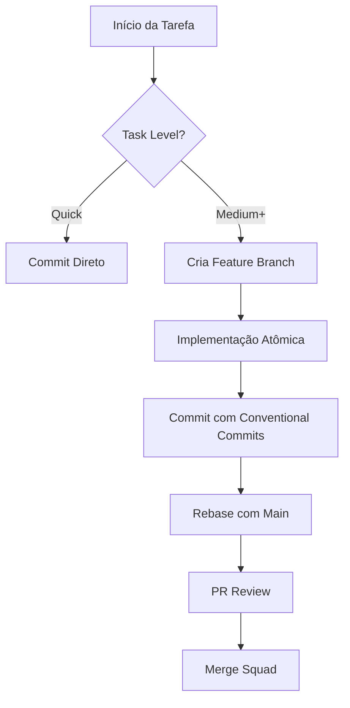

# Plan: Git Workflow Skill Integration

## Arquitetura da Skill
A skill seguirá o modo **Standard** do `skill-factory`, com uma estrutura limpa e expansível.

### Estrutura de Arquivos
- `git-workflow/SKILL.md`: O motor da skill com workflows e mandatos.
- `git-workflow/README.md`: Guia de referência rápida para o usuário.
- `git-workflow/CHANGELOG.md`: Histórico de versões (inicia em 1.0.0).
- `git-workflow/references/conventional-commits.md`: Detalhamento dos tipos de commit.
- `git-workflow/references/branching-strategies.md`: Detalhamento das estratégias.
- `git-workflow/examples/gitmessage.template`: Template para configuração local.

## Mapeamento de Conteúdo (ECC -> Hub)
- **Branching Strategies** -> Traduzido e integrado em `references/`.
- **Conventional Commits** -> Traduzido e integrado em `references/`, com ênfase no uso obrigatório do Inglês.
- **Merge vs Rebase** -> Integrado na `SKILL.md` como diretriz operacional.
- **PR Templates** -> Adicionado em `examples/`.

## Integração SDD (Nova Seção)
Adicionar seção "Git no Workflow SDD":
- **Discovery**: Mapear branches existentes.
- **Implement**: Commits atômicos por tarefa (`tasks.md`).
- **Review**: Revisão de histórico limpo antes do merge.

## Diagramas Mermaid
Incluir diagrama de fluxo do Ciclo de Commit SDD.

