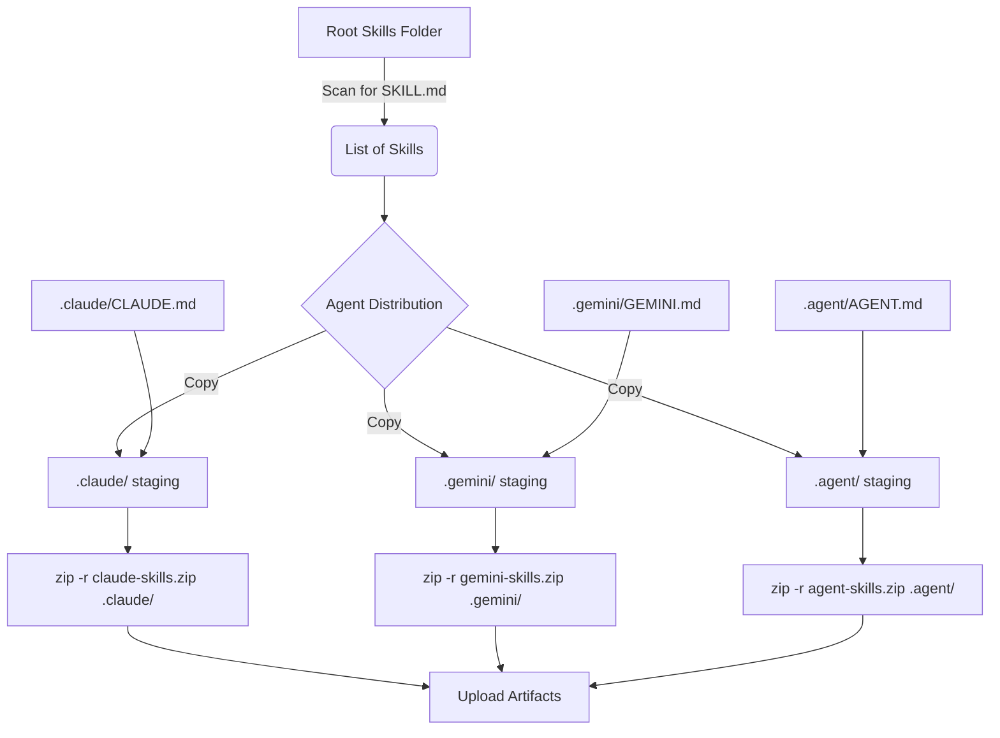

# Technical Plan: GitHub Actions Skills Artifacts

Este plano detalha a implementação técnica do pipeline para geração e distribuição das skills.

## Architecture & Workflow

O pipeline utilizará o GitHub Actions para processar as skills e gerar artefatos ZIP.

## Implementation Strategy

1. **Workflow Trigger**: `on: push` para a branch `main` e `on: workflow_dispatch`.
2. **Skill Discovery**: Comando `find . -maxdepth 2 -name "SKILL.md" -not -path '*/.*' -exec dirname {} \;` para obter a lista dinâmica de skills.
3. **Artifact Preparation**:
    - Utilizar uma pasta temporária `dist/` para montagem.
    - Para cada agente, criar a pasta correspondente (ex: `dist/.claude/skills/`).
    - Copiar as instruções globais (`CLAUDE.md`, etc.) para a raiz da pasta do agente em `dist/`.
    - Iterar sobre a lista de skills e usar `cp -r` para populá-las.
4. **Zipping**: Utilizar o comando `zip` do sistema para garantir que as pastas ocultas (como `.claude`) sejam incluídas corretamente.
5. **Artifact Storage**: Utilizar `actions/upload-artifact` para disponibilizar os ZIPs no GitHub.

## Mapping Table

| Agent | Artifact Name | Source Meta File | Target Folder |
|-------|---------------|------------------|---------------|
| Claude | `claude-skills.zip` | `.claude/CLAUDE.md` | `.claude/` |
| Gemini | `gemini-skills.zip` | `.gemini/GEMINI.md` | `.gemini/` |
| Agent | `agent-skills.zip` | `.agent/AGENT.md` | `.agent/` |

## Verification Plan

- Criar um script de teste `scripts/verify-artifacts.sh` para validar localmente (antes de subir o workflow) se a estrutura do `dist/` está correta.
- Executar o pipeline e verificar o conteúdo do ZIP baixado.
