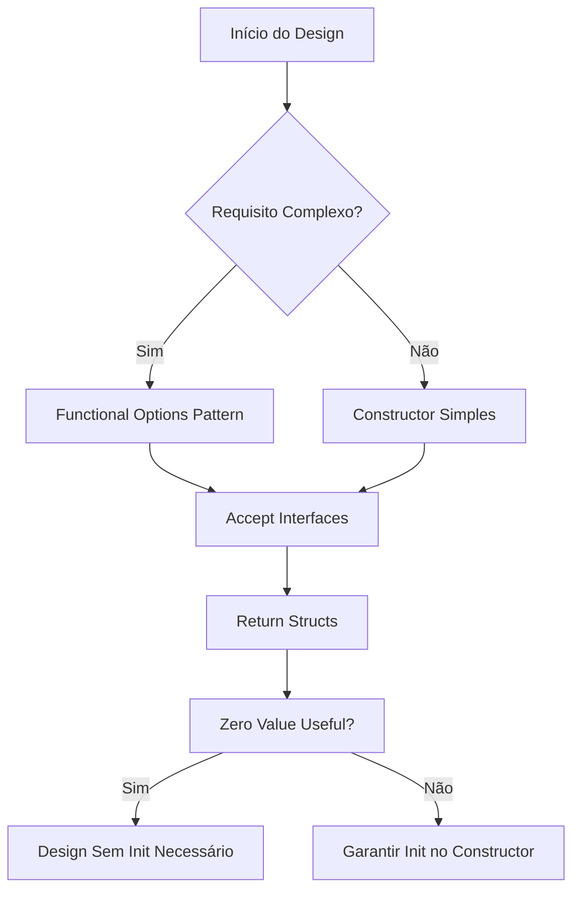
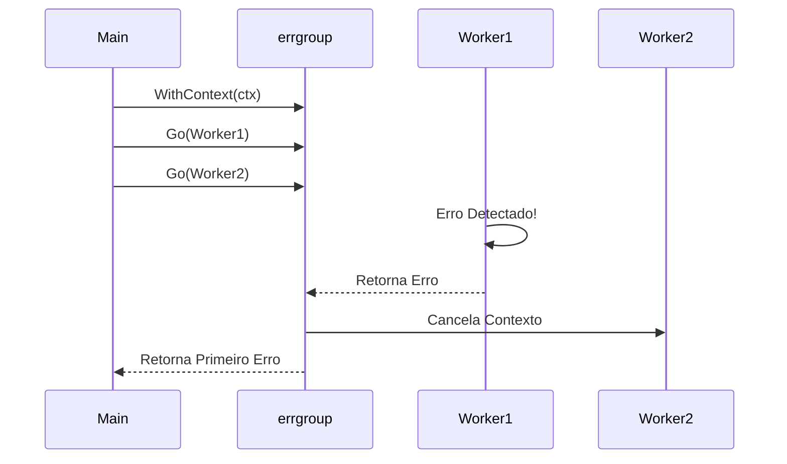

# Plan: Golang Expert Skill Enrichment

## 1. Arquitetura das Mudanças
O enriquecimento será distribuído entre o arquivo mestre da skill e seus pilares de referência, garantindo que o conhecimento esteja organizado por contexto.

### 1.1. Fluxo de Decisão de Design

### 1.2. Orquestração de Concorrência

## 2. Implementação por Arquivo

### 2.1. `SKILL.md` (Core)
- Adicionar os novos mandatos na seção `Quality Rules`.
- Atualizar a seção `Prohibited` com a restrição de contextos em structs.
- Incluir `errgroup` no `High-Concurrency Design`.
- Adicionar itens ao `Performance Checklist`.

### 2.2. `references/foundations.md`
- Exemplificar **Accept Interfaces, Return Structs**.
- Exemplificar **Functional Options**.
- Exemplificar **Zero Value Useful**.
- Documentar **Consumer-Defined Interfaces**.

### 2.3. `references/concurrency.md`
- Adicionar seção detalhada de `errgroup`.
- Adicionar seção de **Graceful Shutdown** com sinais do SO.

### 2.4. `references/development.md`
- Listar comandos essenciais do ECC.
- Recomendar configuração específica do `golangci-lint`.
- Adicionar link direto para a skill especializada `golang-testing-expert`.

### 2.5. Nova Skill: `golang-testing-expert`
- **SKILL.md**: Frontmatter ECC, descrição de TDD e comandos de teste.
- **references/foundations.md**: TDD Cycle, Table-Driven Tests, Subtests.
- **references/advanced.md**: Mocks, Helpers, Golden Files, httptest.
- **references/performance.md**: Benchmarks e Fuzzing.

## 3. Estratégia de Validação
- **Unitária**: Verificar se os exemplos de código são compiláveis.
- **SDD Compliance**: Garantir que todos os arquivos seguem o padrão do Hub.
- **Linter**: Executar `validate_skills.py` (se disponível) para garantir conformidade estrutural.
