# Technical Plan: Golang Expert Skill

## 🗺️ Mermaid Diagram: Skill Architecture

```mermaid
graph TD
    GE[golang-expert] --> F[references/foundations.md]
    GE --> C[references/concurrency.md]
    GE --> D[references/development.md]
    GE --> A[references/architecture.md]
    GE --> E[references/ecosystem.md]

    subgraph "Pilar 1: Foundations"
        F --> F1[Naming & Style]
        F --> F2[Structs & Interfaces]
        F --> F3[Error Handling]
        F --> F4[Project Layout]
    end

    subgraph "Pilar 2: Concurrency"
        C --> C1[Goroutines & Channels]
        C --> C2[Context]
        C --> C3[Safety & Design Patterns]
    end

    subgraph "Pilar 3: Development"
        D --> D1[CLI & Modules]
        D --> D2[Linter & Testing]
        D --> D3[Troubleshooting]
    end

    subgraph "Pilar 4: Architecture"
        A --> A1[gRPC & Databases]
        A --> A2[Observability & Performance]
        A --> A3[Security & CI/CD]
    end

    subgraph "Pilar 5: Ecosystem"
        E --> E1[Modernize & Popular Libs]
        E --> E2[Samber Libraries lo, mo, do, slog, hot, ro, oops]
    end
```

## 📂 Project Structure
- `golang-expert/`
  - `SKILL.md` (Ponto de entrada orquestrado)
  - `README.md` (Documentação do Hub)
  - `CHANGELOG.md` (v1.0.0)
  - `references/`
    - `foundations.md`
    - `concurrency.md`
    - `development.md`
    - `architecture.md`
    - `ecosystem.md`
  - `examples/`
    - `concurrency-patterns/`
    - `testing-testify/`
    - `samber-utilities/`

## 🚀 Execution Strategy
1. **Bootstrap**: Executar `skill-factory-bootstrap` para criar a estrutura básica.
2. **References**: Criar os 5 arquivos de referência com base nas 35 skills identificadas.
3. **Skill-Doc**: Preencher o `SKILL.md` com as instruções de nível Expert e referências cruzadas.
4. **Examples**: Adicionar exemplos idiomáticos de alta qualidade.
5. **Validation**: Executar `skill-factory-validator`.
6. **Registration**: Registrar no README raiz e atualizar o `KNOWLEDGE-MAP.mermaid`.
