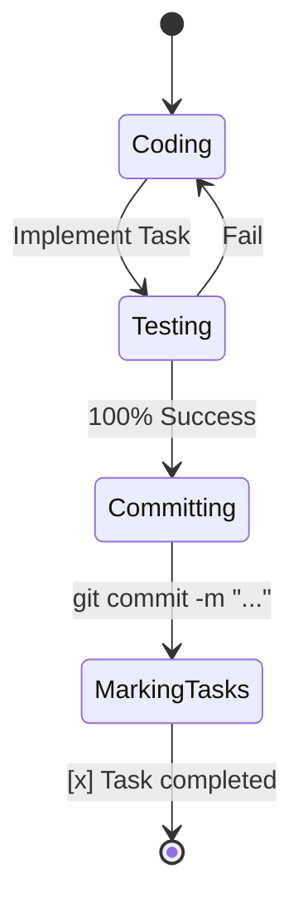

# Plan: Governance Hardening

## 1. Mapeamento de Alterações

### 1.1. `sdd/SKILL.md` (v1.5.0)
- **Seção Fase 3**: Adicionar o parágrafo proibitivo sobre Testes e Git.
- **Seção Quality Rules**: Incluir a obrigatoriedade da atomicidade do commit por task.

### 1.2. `onboarding-navigator/SKILL.md` (v1.1.0)
- **Seção Session Exit Gate**: Incluir verificação de commits pendentes e conformidade com a `git-workflow`.

## 2. Diagrama de Ciclo Atômico (SDD-Git)

## 3. Tarefas de Implementação
- **T1**: Criar Spec (Concluído).
- **T2**: Criar Plano (Atual).
- **T3**: Atualizar `sdd/SKILL.md`.
- **T4**: Atualizar `onboarding-navigator/SKILL.md`.
- **T5**: Criar `contract.md` e `tasks.md` para esta feature.
- **T6**: Gerar relatório de validação.
