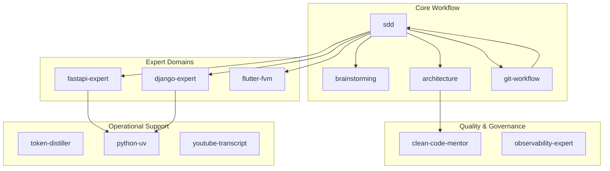

# Engineering Plan: Governance Hardening

## 🏗 Architecture

### 1. Global Knowledge Hub (`KNOWLEDGE-MAP.mermaid`)
A Mermaid diagram showing the skill ecosystem.


```mermaid
graph TD
    subgraph Core ["Core Workflow"]
        SDD[sdd] --> BR[brainstorming]
        SDD --> ARCH[architecture]
        SDD --> GIT[git-workflow]
    end

    subgraph Quality ["Quality & Governance"]
        CCM[clean-code-mentor]
        OBS[observability-expert]
        GIT --> SDD
    end

    subgraph Domain ["Expert Domains"]
        SDD --> DJ[django-expert]
        SDD --> FA[fastapi-expert]
        SDD --> FL[flutter-fvm]
    end

    subgraph Operational ["Operational Support"]
        TD[token-distiller]
        UV[python-uv]
        YT[youtube-transcript]
    end

    %% Relationships
    ARCH --> CCM
    FA --> UV
    DJ --> UV
```

### 2. Audit Script (`bin/audit-governance.py`)
- **Engine**: Python 3.
- **Logic**: 
    1. Scan recursive directories for `.md` files.
    2. Ignore `node_modules`, `.git`, etc.
    3. Check for the string `<!-- @sdd-state -->`.
    4. Parse the YAML block using a simple regex or `PyYAML` (if available, otherwise regex for simplicity).
    5. Report files missing the block or with `status: COMPLETED` but `evidence_checksum: NONE`.

### 3. Makefile Integration
Add `audit` target:
```makefile
audit:
	python3 bin/audit-governance.py
```

## 🚀 Implementation Phases

### Phase 1: Knowledge Mapping
1. Create `KNOWLEDGE-MAP.mermaid`.
2. Reference it in `README.md`.

### Phase 2: Audit Automation
1. Create `bin/audit-governance.py`.
2. Add `audit` target to `Makefile`.
3. Run and fix existing violations (if any).

### Phase 3: Mandate Hardening
1. Update `GLOBAL_MANDATES.md`.
2. Run `make sync` (if applicable) to propagate changes.

---

<!-- @sdd-state -->
```yaml
version: "2.3.0"
feature_id: "GOVERNANCE-HARDENING"
phase: "SPECIFY"
status: "IN_PROGRESS"
last_update: "2026-05-09T12:05:00Z"
evidence_checksum: "NONE"
```
