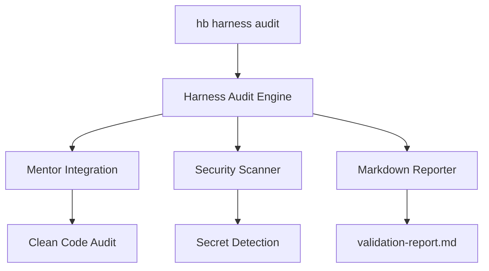

# Implementation Plan: Harness Audit Gate

## Architecture

The implementation will follow the Hexagonal Architecture pattern already established in the `hb` project.

### 1. Command Layer (`hb/cmd/`)
- Add `audit` as a subcommand of `harness` in `hb/cmd/harness.go` (or a new file if it gets too big).
- **Signature**: `hb harness audit [path] [--sec] [--mentor] [--all]`

### 2. Domain/Internal Layer (`hb/internal/harness/`)
- Create `hb/internal/harness/audit.go`.
- Implement `ExecuteAudit(path string, config AuditConfig) (*AuditResult, error)`.

### 3. Integration Layer
- **Mentor**: Call `internal/mentor.AuditFile`.
- **Security**: Create `internal/security/scanner.go` to implement secret detection and basic SAST.
- **Reporting**: Implement a markdown generator for `validation-report.md`.

## Data Schema (AuditResult)
```go
type AuditResult struct {
    Timestamp   time.Time
    Path        string
    Issues      []Issue
    Passed      bool
    Score       float64
}

type Issue struct {
    Type     string // "Security", "Quality"
    Severity string // "Critical", "Warning", "Info"
    Message  string
    File     string
    Line     int
}
```

## Mermaid Diagram

