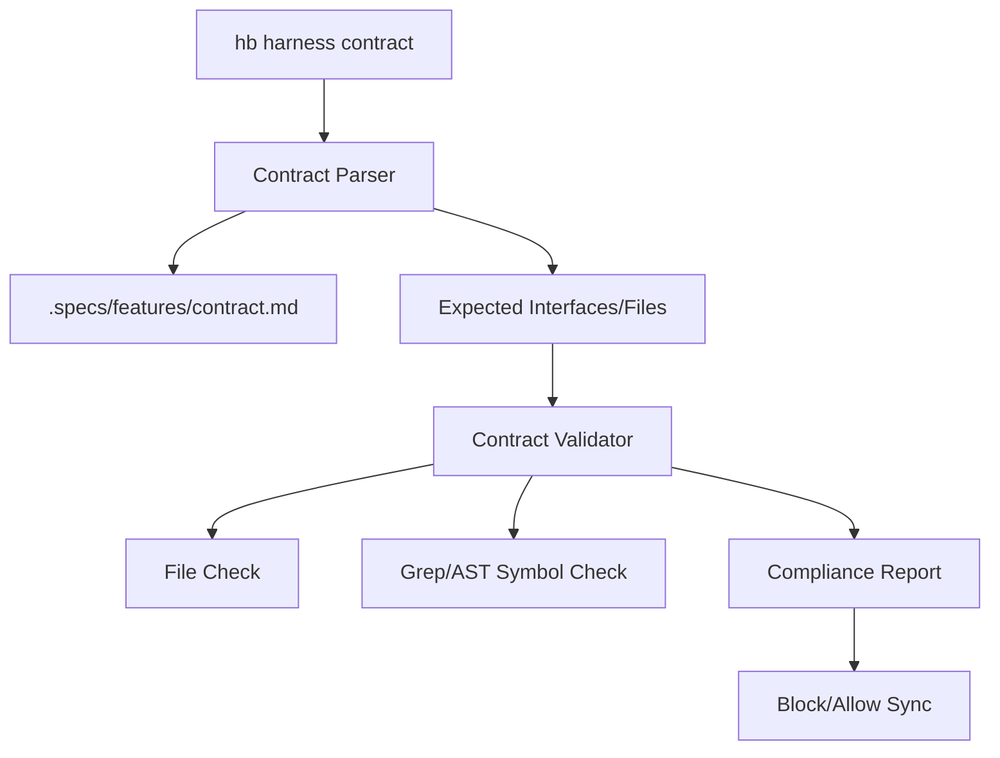

# Implementation Plan: Harness Contract Guardian

## Architecture

### 1. CLI Layer
- Subcommand `contract [feature]` in `hb/cmd/harness.go`.

### 2. Domain Layer (`hb/internal/harness/contract.go`)
- `ExecuteContractCheck(root, feature string) error`
- `Parser`: Logic to extract tables from Markdown.
- `Validator`: Logic to verify existence of symbols and files.

### 3. Implementation Details
- **Markdown Parsing**: Use regex to find markdown tables `| Interface | ... |`.
- **Symbol Search**: 
    - Use `grep` (via `exec.Command`) to look for strings like `var <name> = &cobra.Command` or `func <name>`.
- **Feature Detection**: Auto-detect feature by looking into `.specs/features/`.

## Mermaid Diagram

