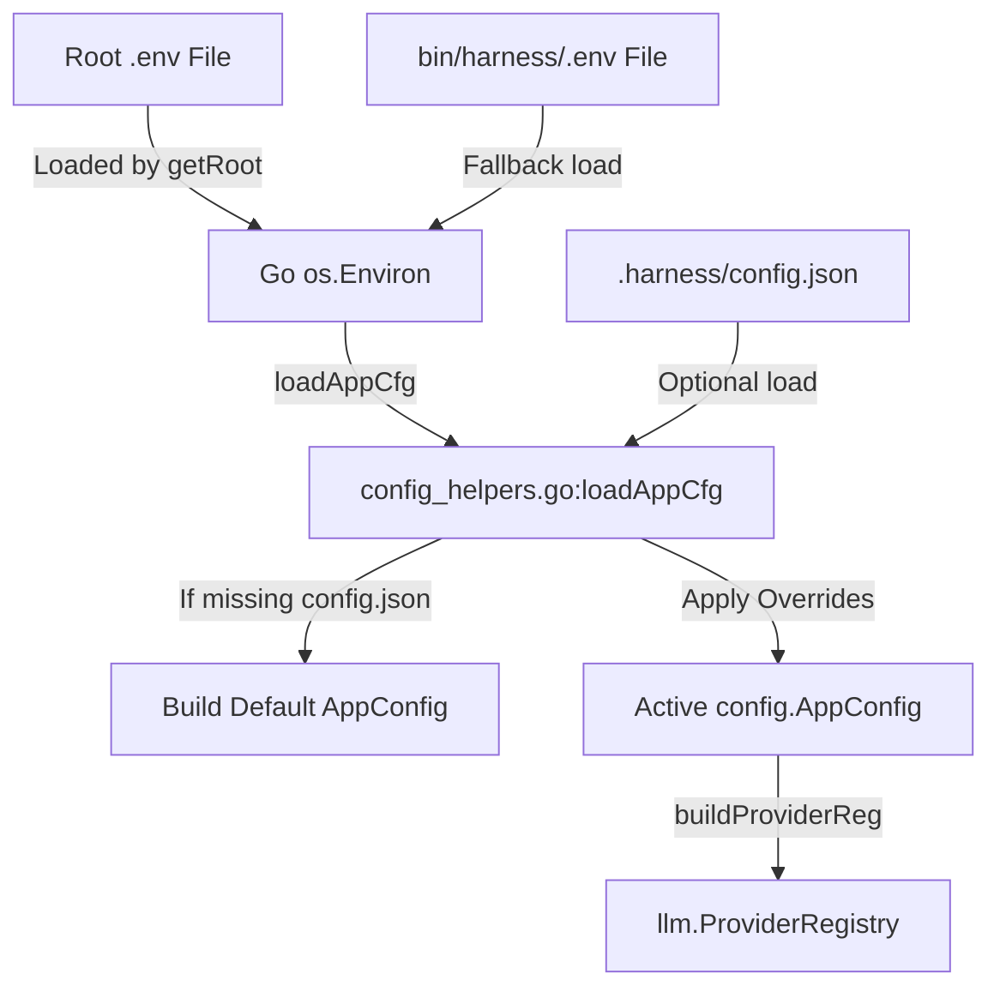

# Implementation Plan: Harness Environment Overrides & Root .env Support

This plan details the technical changes required to support root-level `.env` loading, zero-config startup, and dynamic environment overrides.

## System Architecture



## Proposed Changes

### Component: configuration & startup

#### [MODIFY] [config_helpers.go](file:///home/kleberson/Documentos/skills/bin/harness/config_helpers.go)
- Update `loadAppCfg` to not fail if `.harness/config.json` is missing.
- If missing, call a new helper `buildDefaultAppConfig()` which returns a default `AppConfig` with popular providers configured.
- Support both `HARNESS_PROVIDER` / `ACTIVE_PROVIDER` and `HARNESS_MODEL` / `ACTIVE_MODEL` overrides.
- Dynamically inject missing default provider definitions into the loaded `cfg.Providers` map if a custom config doesn't define them but the env requests them.

#### [MODIFY] [config.go](file:///home/kleberson/Documentos/skills/bin/harness/internal/config/config.go)
- Ensure `.env` is loaded cleanly.
- Keep `LoadEnvFile` robust.

### Component: workspace structure

#### [NEW] [.env.example](file:///home/kleberson/Documentos/skills/.env.example)
- Create a copy of `bin/harness/.env.example` at the root of the workspace.

## Verification Plan

### Automated Tests
- Run `make harness-test` to ensure all tests pass.
- Add test coverage in `config_test.go` or `harness_test.go` for the fallback configuration.

---

<!-- @sdd-state -->
```yaml
version: "2.3.0"
feature_id: "HARNESS-ENV-OVERRIDES"
phase: "SPECIFY"
status: "COMPLETED"
last_update: "2026-05-23T02:47:00Z"
evidence_checksum: "ffb546e"
```
