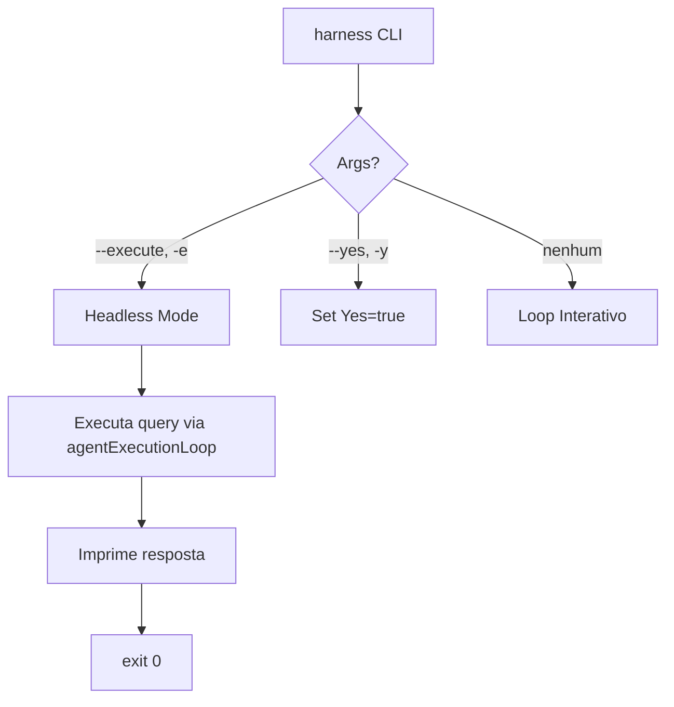

# Plan: Harness Headless/CI Mode

## Architecture

### 1. Global Headless Config (main.go)
Adicionar struct `HeadlessConfig` com campos `Yes bool` e `Query string`.

### 2. ExecuteCommand bypass (tools.go)
Modificar `ExecuteCommand` para receber `HeadlessConfig`. Se `Yes=true`, bypassar approval gate.

### 3. agentExecutionLoop (main.go)
Adaptar para modo headless: não entrar em loop, executar uma iteração e sair.

## Files Changed
- `bin/harness/main.go` — parsing de args, headless config, modo headless
- `bin/harness/tools.go` — approval gate condicional
- `bin/harness/harness_test.go` — teste para bypass
