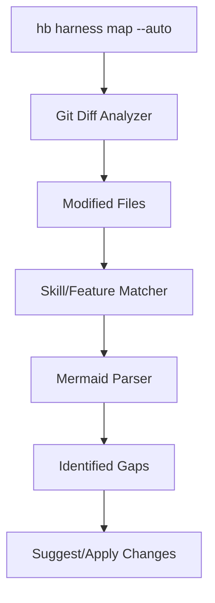

# Implementation Plan: Harness Knowledge Sync

## Architecture

### 1. CLI Layer
- Flag `--auto` in `hb/cmd/map.go`.
- Subcommand `map` in `hb harness` (alias to `hb map --auto`).

### 2. Domain Layer (`hb/internal/harness/map.go`)
- `ExecuteKnowledgeSync(root string, apply bool) error`
- `GitAnalyzer`: Extracts modified paths.
- `MapperSync`: Cross-references paths with Mermaid nodes.

### 3. Logic Detail
- **Discovery**:
    - `git diff --name-only` -> list of files.
    - Map file -> Owner (Feature or Skill).
- **Inference**:
    - If `feature-A/plan.md` mentions `skill-B`, and `feature-A --> skill-B` is not in mermaid, it's a "Missing Link".
- **Application**:
    - If `--apply`, append the new relation to the `%% Relations` section of `KNOWLEDGE-MAP.mermaid`.

## Mermaid Diagram

