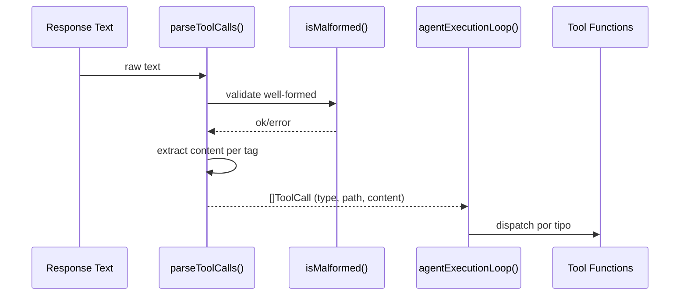

# Plan: Harness XML Parser & Safety Gate

## Architecture

### 1. Parser Tokenizer (tools.go)
Substituir as 5 regexes globais (`readFileRegex`, `writeFileRegex`, etc.) por funções de parse:

- `parseToolCalls(input string) []ToolCall` – varre string em busca de tags XML `<tool:*>`
- `isMalformed(input string) error` – valida fechamento e aninhamento básico
- Mantém structs de resposta idênticas p/ compatibilidade

### 2. Approval Gate (tools.go + distiller.go)
- Adicionar `isDestructiveCommand(cmd string) bool` em `distiller.go`.
- Modificar `ExecuteCommand` p/ verificar antes de executar.
- Se detectado, ler `os.Stdin` p/ confirmação "S/N".

### 3. Limpeza main.go
- Remover variável `compactedHistory` e linhas 360-370 que a declaram e atribuem.

## Files Changed
- `bin/harness/tools.go` – maior parte das mudanças
- `bin/harness/distiller.go` – adicionar `isDestructiveCommand`
- `bin/harness/main.go` – remover código morto
- `bin/harness/distiller_test.go` – adicionar teste p/ `isDestructiveCommand`
- `bin/harness/harness_test.go` – adicionar teste p/ parseToolCalls
