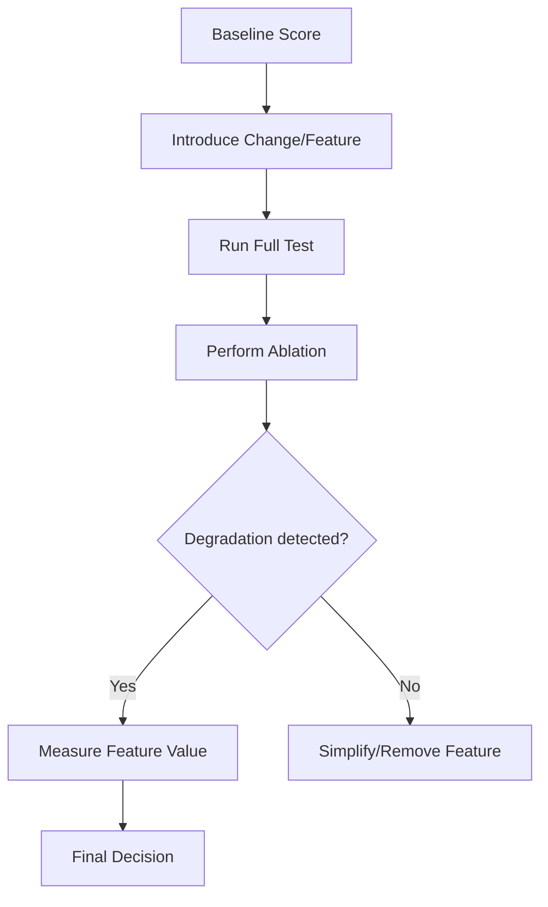

# Plan: New Skill - Harness Science

## 1. Architecture
The skill will be located in `/harness-science`. It will complement `harness-expert` and `benchmark-expert` by adding the "Scientific/Hypothesis" layer.

## 2. Technical Baseline (Mined from `src`)
- **Ablation Flags**:
  - `CLAUDE_CODE_DISABLE_THINKING`: Measures the cost of speed vs. depth.
  - `DISABLE_BACKGROUND_TASKS`: Measures the impact of parallel execution.
  - `CLAUDE_CODE_SIMPLE`: A minimal baseline for regression testing.

## 3. Implementation Steps
1.  **Scaffold**: Create directory and mandatory files.
2.  **Write `SKILL.md`**: Define the scientific method for agents.
3.  **Audit**: `hb audit harness-science`.
4.  **Register**: Update registry and `STATE.md`.

## 4. Mermaid Diagram (Ablation Cycle)

