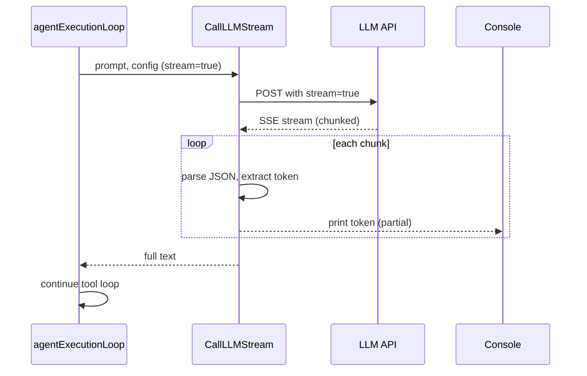

# Plan: Harness Streaming SSE

## Architecture

### 1. Estrutura do Streaming



### 2. Mudanças nos arquivos

| Arquivo | Mudança |
|---------|---------|
| `client.go` | Adicionar `Streaming bool`, `StreamResponsePath string` em `ProviderConfig`. Nova função `CallLLMStream`. |
| `main.go` | Adicionar flag `--stream`. Passar para `agentExecutionLoop`. |
| `harness_test.go` | Testes para `CallLLMStream` com servidor SSE mock. |

### 3. Provider Config Atualizada

```go
type ProviderConfig struct {
    URL                string            `json:"url"`
    Headers            map[string]string `json:"headers"`
    BodyTemplate       string            `json:"body_template"`
    ResponsePath       string            `json:"response_path"`
    Streaming          bool              `json:"streaming"`
    StreamResponsePath string            `json:"stream_response_path"`
}
```
