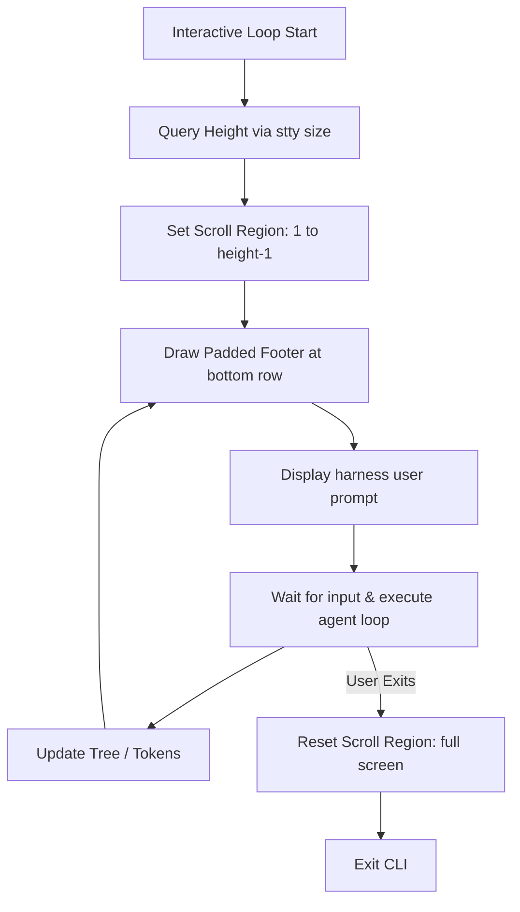

# SDD Technical Plan: plan.md (`HARNESS-TUI-FOOTER`)

This is the technical blueprint for implementing a fixed TUI status footer using pure Go and standard ANSI control sequences.

---

## 1. Architecture Overview
To achieve a "fixed" footer at the bottom of standard scrolling terminals without taking over the full terminal window (which would require complex full-screen widgets), we use **ANSI Scroll Regions** (`DECSTBM`). 
By setting the scrolling region of the terminal to lines `1` through `height-1`, any standard output printed to stdout will scroll inside this upper viewport, while the very bottom row (`height`) remains statically in place.

We write to this bottom row using the standard ANSI sequence:
1. `\033[s` — Save cursor position
2. `\033[<height>;1H` — Move cursor to the bottom-left corner
3. `\033[K` — Clear the entire bottom line
4. Print the styled status bar, padded to the window's `width` using light/dark ANSI colors
5. `\033[u` — Restore cursor position to where the user was typing

## 2. Technical Design

### Terminal Dimensions Hook
We query terminal columns and rows dynamically using `stty size` attached to `os.Stdin`:
```go
func getTerminalSize() (int, int) {
	height, width := 24, 80
	cmd := exec.Command("stty", "size")
	cmd.Stdin = os.Stdin
	if out, err := cmd.Output(); err == nil {
		fmt.Sscanf(string(out), "%d %d", &height, &width)
	}
	return height, width
}
```

### Logic Flow



## 3. Implementation Strategy
- **Target Files**:
  - `internal/tui/tui.go`: Add `DrawFixedFooter(tree, provider, model)` and dynamic size helpers.
  - `interactive.go`: Initialize scroll boundaries, hooks into loop steps, and clear terminal region on shutdown.
- **Testing**: Validate that `stty size` behaves correctly, mock session metrics estimation, and verify terminal teardown exits cleanly.

---
<!-- @sdd-state -->
```yaml
version: "2.3.0"
feature_id: "HARNESS-TUI-FOOTER"
phase: "SPECIFY"
status: "COMPLETED"
last_update: "2026-05-23T03:57:00Z"
evidence_checksum: "NONE"
```
