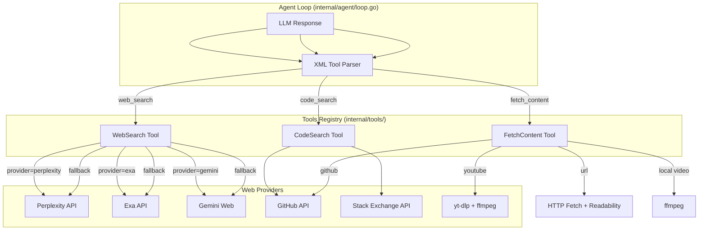

# Harness Web Tools — Architecture Plan

## High-Level Flow



## XML Tool Interface

### web_search
```xml
<tool:web_search query="como fazer X em Go"/>
<tool:web_search queries="["query1","query2","query3"]" numResults="5" recencyFilter="week"
    domainFilter="["stackoverflow.com","-reddit.com"]" provider="perplexity"/>
```

### code_search
```xml
<tool:code_search query="python async with httpx" maxTokens="10000"/>
```

### fetch_content
```xml
<tool:fetch_content url="https://example.com/doc"/>
<tool:fetch_content urls="["url1","url2"]" prompt="analise a diferença entre os dois"/>
<!-- YouTube -->
<tool:fetch_content url="https://youtube.com/watch?v=xxx" prompt="o que o autor diz sobre X"/>
<!-- GitHub -->
<tool:fetch_content url="https://github.com/user/repo" forceClone="true"/>
<!-- Video local -->
<tool:fetch_content path="/caminho/video.mp4" prompt="descreva a cena" timestamp="1:23:45" frames="6"/>
```

## File Structure

```
bin/harness/internal/tools/
├── executor.go        (já existe - Registry + ferramentas locais)
├── websearch.go       (NOVO - WebSearch executor)
├── codesearch.go      (NOVO - CodeSearch executor)
└── fetch.go           (NOVO - FetchContent executor)

bin/harness/internal/llm/
├── provider.go        (já existe)
├── call.go            (já existe)
├── ...
└── web.go             (NOVO - Web search provider clients: Perplexity, Exa, Gemini)

bin/harness/cmd_init.go (modificado - adicionar web search providers)
bin/harness/cmd_mcp.go  (modificado - registrar novas tools no MCP server)
```

---

<!-- @sdd-state -->
```yaml
version: "2.3.0"
feature_id: "harness-web-tools"
phase: "SPECIFY"
status: "IN_PROGRESS"
last_update: "2026-05-22T16:18:00Z"
```
