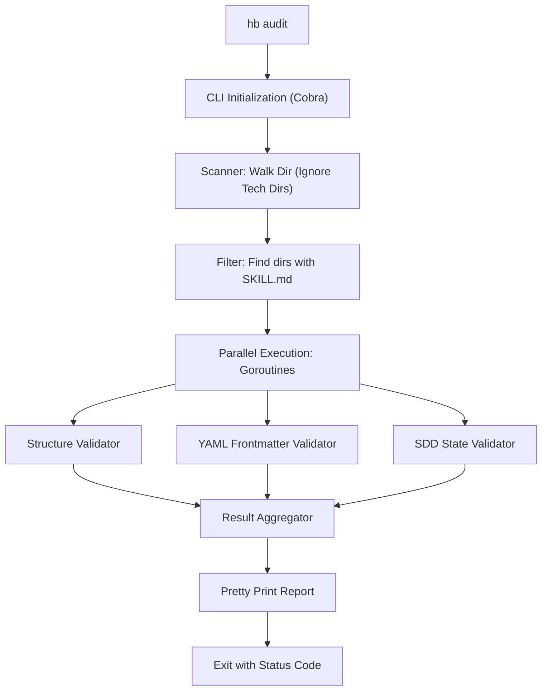

# Plan: HB-CLI - Architecture & Implementation

## 1. Arquitetura (Standard Go Layout)
Para garantir manutenibilidade e seguir a `golang-expert`, utilizaremos:
- `main.go`: Ponto de entrada simplificado na raiz da pasta `hb/`.
- `internal/scanner/`: Lógica de descoberta de skills.
- `internal/validator/`: Motores de validação (Estrutura, YAML, SDD).
- `internal/report/`: Formatação de saída (Console, JSON).
- `internal/domain/`: Definições de tipos (Skill, AuditResult).

## 2. Diagrama de Fluxo

## 3. Stack Tecnológica
- **Go 1.21+**
- **Cobra (spf13/cobra)**: CLI framework.
- **YAML (gopkg.in/yaml.v3)**: Parsing de metadados.
- **Color (fatih/color)**: Feedback visual.
- **Tablewriter (olekukonko/tablewriter)**: Relatórios formatados.

## 5. Estratégia de Distribuição
Utilizaremos o recurso nativo de cross-compilation do Go:
1. **GitHub Actions**: Pipeline acionado por tags `v*`.
2. **Matrix Build**:
   - `GOOS=darwin GOARCH=arm64` (Mac Apple Silicon)
   - `GOOS=darwin GOARCH=amd64` (Mac Intel)
   - `GOOS=linux GOARCH=amd64` (Linux Server/Ubuntu)
   - `GOOS=windows GOARCH=amd64` (Windows Desktop)
3. **Artifact Storage**: Upload dos binários para GitHub Releases.

## 4. Estratégia de Implementação
1. **Fase 1**: Setup do projeto Go e CLI básica com Cobra.
2. **Fase 2**: Implementação do Scanner concorrente.
3. **Fase 3**: Implementação dos validadores core (presença de arquivos).
4. **Fase 4**: Parsing de Frontmatter e validação de SemVer.
5. **Fase 5**: UI e relatórios finais.
