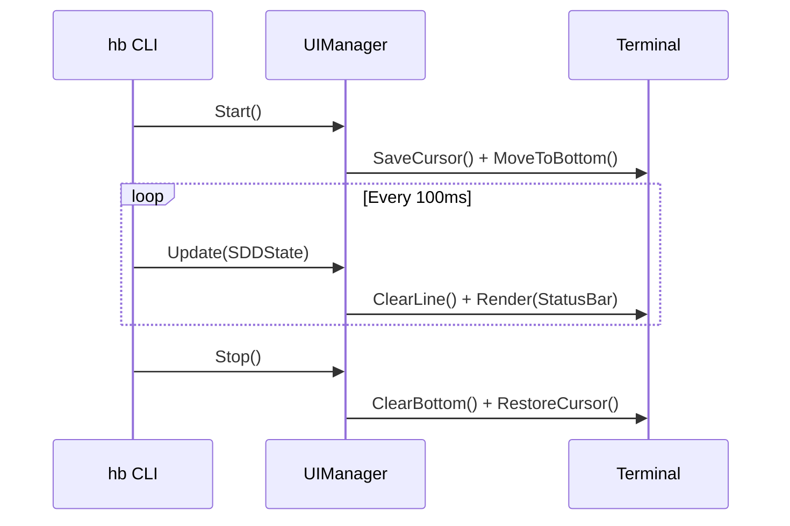

# Technical Plan: HB-CLI Premium UI

## Architecture
The UI will be implemented as a separate package `hb/internal/ui`. It will follow a **Producer-Consumer** pattern where the main `hb` logic (SDD, Harness) produces updates, and the `UIManager` consumes them to render the status bar.

### Core Components
- **`UIManager`**: The main struct responsible for managing the terminal state and rendering loop.
- **`StatusBar`**: A sub-component that calculates the ANSI strings for the footer.
- **`TerminalEngine`**: A wrapper around `os.Stdout` that handles the low-level ANSI escape codes.

### Diagram (Sequence)


## Data Schema (Go)
```go
type UIState struct {
    FeatureName string
    CurrentTask string
    Progress    float64 // 0.0 to 1.0
    TokenCount  int
    Cost        float64
    Status      string // "Running", "Paused", "Error"
}
```

## Implementation Steps

### 1. Low-Level ANSI Package
Create `hb/internal/ui/ansi.go` with helper functions for:
- `HideCursor()` / `ShowCursor()`
- `SaveCursor()` / `RestoreCursor()`
- `MoveCursor(row, col)`
- `ClearLine()`

### 2. UI Manager
Create `hb/internal/ui/manager.go`. This will run a background goroutine for the "Ticker" to avoid blocking the main execution.

### 3. Integration with SDD
Modify `hb/internal/sdd` to emit events or update a shared `UIState`.

## Testing Strategy (100% Coverage Goal)
- **Unit Tests**: Every ANSI function will be tested against a `bytes.Buffer`.
- **State Tests**: Verify that `UIState` updates result in the expected ANSI output strings.
- **Mock Terminal**: Create a mock that implements `io.Writer` and validates the sequence of cursor movements.

## Security & Performance
- **ANSI Sanitization**: Ensure no malicious strings can be injected into the UI.
- **Performance**: Limit refresh rate to 10-15 FPS (100ms) to avoid CPU spikes in the terminal emulator.
