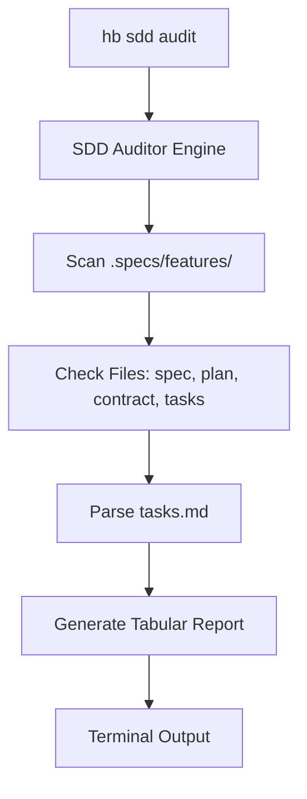

# Implementation Plan: SDD Auditor

## Architecture

### 1. CLI Layer
- Subcommand `audit` in `hb/cmd/sdd.go`.

### 2. Domain Layer (`hb/internal/sdd/auditor.go`)
- `FeatureStatus` struct to store results per feature.
- `AuditFeatures(root string) ([]FeatureStatus, error)`
- `ParseProgress(path string) float64`

### 3. Logic Details
- **Scanning**: Use `os.ReadDir` on `.specs/features/`.
- **Parsing**: Use `bufio.Scanner` to look for `- [x]` and `- [ ]`.
- **Formatting**: Use `text/tabwriter` for a clean terminal table.

## Mermaid Diagram

