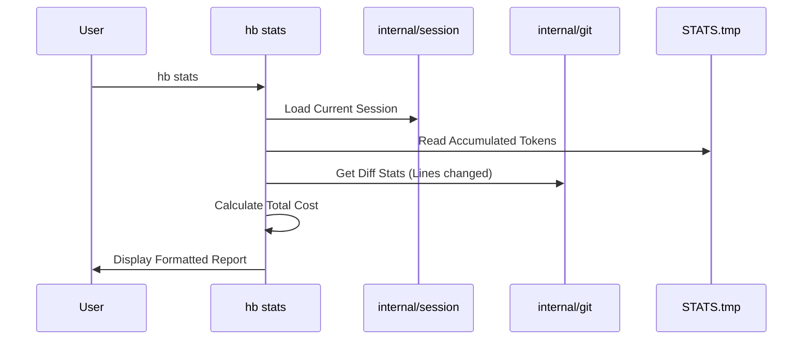
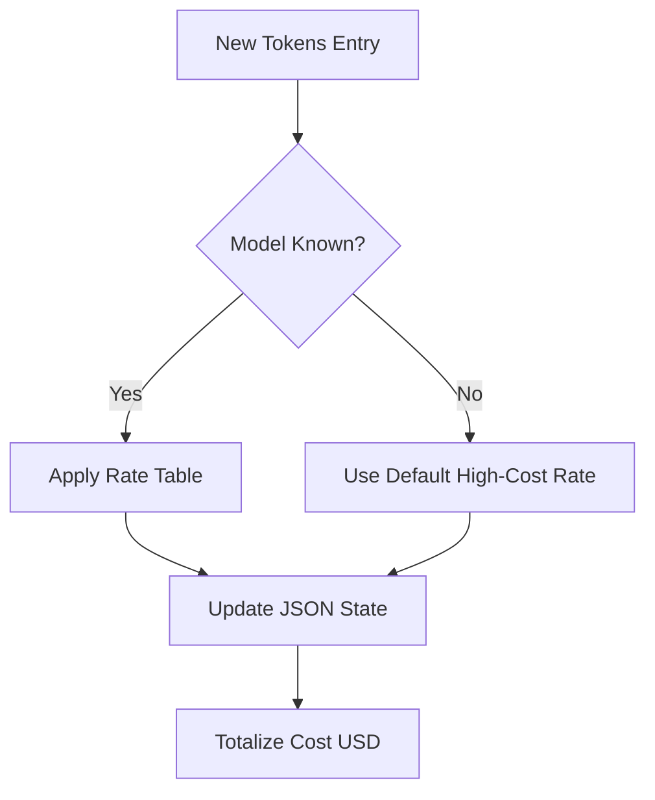

# Technical Plan: HB-CLI Advanced Stats & Cost Tracking

## Architecture
O sistema de estatísticas será integrado ao pacote `internal/session` e terá um novo componente `internal/stats`.

### Components
1. **Stats Model**: Estrutura de dados para armazenar tokens e custos.
2. **Collector**: Lógica para extrair métricas do ambiente (ex: Git para linhas alteradas).
3. **Calculator**: Engine de cálculo de custo USD baseado em tabelas de preços de modelos.
4. **CLI Command**: Comando `hb stats` e sub-comandos se necessário.

## Data Schema (JSON)
O arquivo `.specs/project/STATS.tmp` terá a seguinte estrutura:
```json
{
  "session_id": "uuid",
  "start_time": "RFC3339",
  "models": {
    "gemini-1.5-pro": {
      "input_tokens": 1000,
      "output_tokens": 500,
      "cache_read_tokens": 200,
      "cache_write_tokens": 50,
      "cost_usd": 0.005
    }
  },
  "total_cost_usd": 0.005,
  "git_stats": {
    "lines_added": 150,
    "lines_removed": 20
  }
}
```

## Mermaid Diagrams

### Session Stats Flow


### Cost Calculation Logic


## Implementation Strategy
1. **Task 1**: Definir estrutura `Stats` em `internal/domain`.
2. **Task 2**: Implementar persistência JSON em `internal/stats`.
3. **Task 3**: Integrar `hb session start` para inicializar o arquivo de stats.
4. **Task 4**: Criar comando `hb stats` para visualização.
5. **Task 5**: Implementar lógica de integração com Git para contagem de linhas.
6. **Task 6**: Adicionar suporte a atualização de tokens via CLI (ex: `hb stats add --tokens 100 --model x`).
