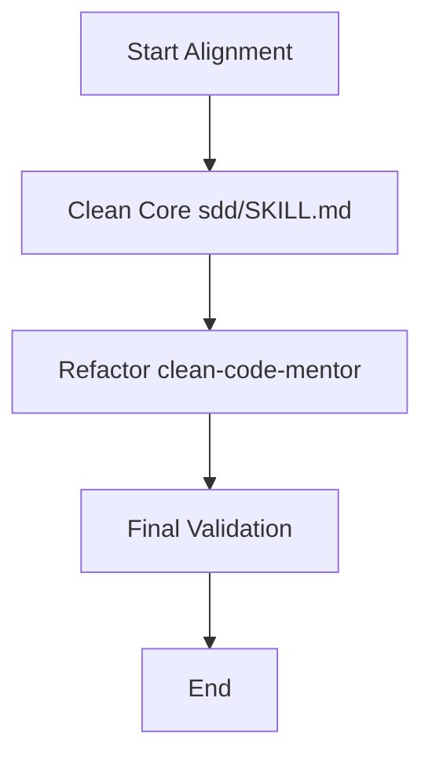

# Plan: Hub Purity Alignment

## 1. Architecture & Design
No structural changes to code, only updates to governance documentation (Markdown).

## 2. Execution Steps

### Step 1: Core Purity (`sdd/SKILL.md`)
- Remove "Real-Time Progress Monitoring" section that mentions `hb`.
- Replace it with "Manual Progress Tracking" focusing on `tasks.md` and atomic commits.
- Bump version to `2.2.1`.

### Step 2: Quality Refactor (`clean-code-mentor/SKILL.md`)
- Delete "Mandatory Tooling" (lines 19-24).
- Update Phase 4 (MENTOR) to remove the call to `hb harness audit`.
- Align prerequisites with the Triad of Memory.
- Bump version to `2.2.0`.

### Step 3: Global Sync
- Update `.specs/project/STATE.md` to reflect the progress.

## 3. Mermaid Flow

