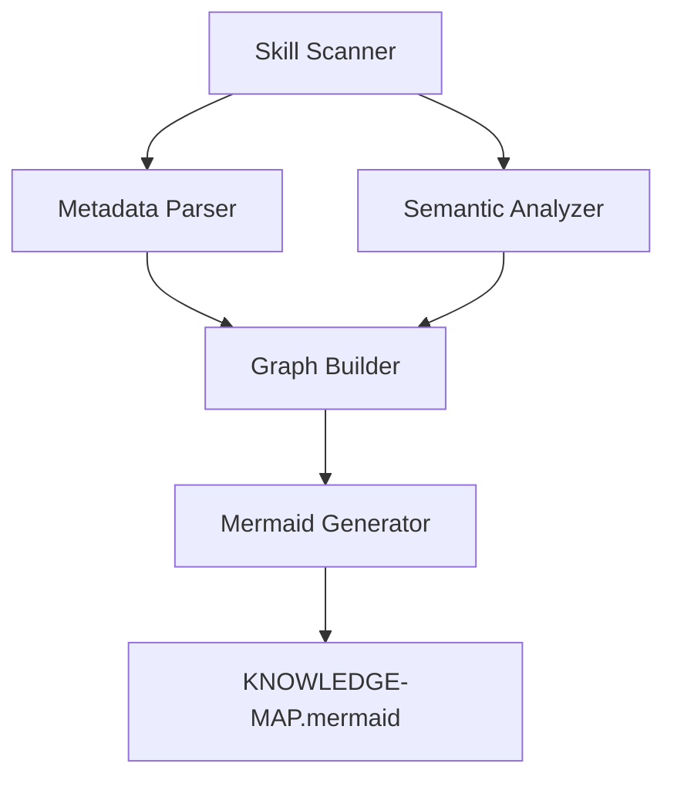
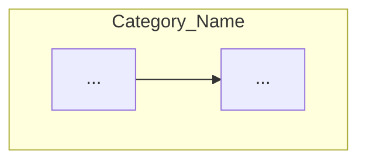

# Technical Plan: Automated Knowledge Distiller

## 🏗️ Arquitetura
Evolução do script `generate_knowledge_map.py` para um modelo de "análise de grafo".

## 🛠️ Design de Implementação

### Componentes:
1.  **Enhanced Metadata Parser**: Extrair `version`, `category`, `uses` (list), e `status`.
2.  **Semantic Analyzer**:
    *   Procurar links Markdown para outras skills `[Skill](...)`.
    *   Procurar nomes de skills em texto puro (usando limites de palavra `\b`).
3.  **Mermaid Generator**:
    *   Dicionário de mapeamento de Categorias -> Nomes amigáveis de Subgrafos.
    *   Template literal para `subgraph`.
    *   Injeção de estilos CSS no Mermaid.

### Estrutura do Mermaid Gerado:

## 🏁 Milestones
1.  [ ] Refatorar extração de metadata para usar `scripts/utils.py`.
2.  [ ] Implementar lógica de `subgraph` baseada em categoria.
3.  [ ] Implementar suporte ao campo `uses` no YAML.
4.  [ ] Adicionar legenda e badges visuais.
