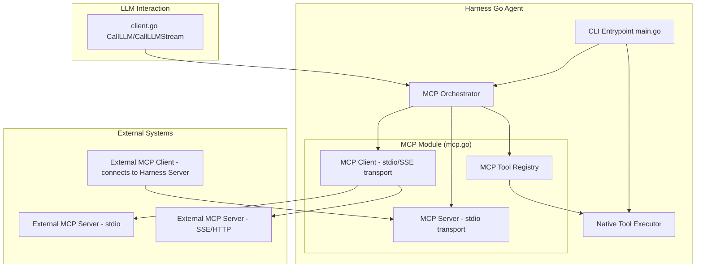

# Implementation Plan — MCP Integration

## Architecture Overview



## Proposed Changes

### New File: `bin/harness/mcp.go`
Central MCP module containing:
- `MCPTool` struct (name, description, inputSchema JSON)
- `MCPServer` struct — stdio-based MCP server
- `MCPClient` struct — connects to external servers
- `MCPRegistry` — manages available tools from all sources

### Modified: `bin/harness/main.go`
- New command: `harness mcp-server` → starts MCP server mode
- New command: `harness mcp-client <server-name>` → interactive MCP client shell
- Load MCP configuration from `.harness/config.json`
- Route LLM tool calls through MCP registry when available

### Modified: `bin/harness/client.go`
- Add MCP-aware tool resolution in `agentExecutionLoop`
- If MCP server configured, prefer MCP tools over native for matching operations

### Modified: `bin/harness/session.go`
- Add MCP tool call node type to DAG
- Log MCP interaction metadata

## Implementation Phases

### Phase 1: MCP Core Protocol
- [ ] Implement JSON-RPC message parsing (request/response/notification)
- [ ] Implement stdio transport layer
- [ ] Implement SSE transport layer (reuse existing SSE patterns from `client.go`)
- [ ] Implement tool discovery protocol (list_tools call)

### Phase 2: MCP Server Mode
- [ ] Implement `harness mcp-server` command
- [ ] Expose native tools as MCP tools with JSON Schema
- [ ] Handle tool call requests from external clients

### Phase 3: MCP Client Mode
- [ ] Implement `harness mcp-client` command
- [ ] Connect to external servers and discover tools
- [ ] Integrate discovered tools into agent execution loop

### Phase 4: Configuration & Integration
- [ ] Add `mcp` section to `.harness/config.json`
- [ ] Wire MCP into existing agent flow (automatic routing)
- [ ] Add session logging for MCP operations

---

<!-- @sdd-state -->
```yaml
version: "2.3.0"
feature_id: "mcp-integration"
phase: "SPECIFY"
status: "IN_PROGRESS"
last_update: "2026-05-23T16:35:00Z"
evidence_checksum: "plan-draft-v1"
```
