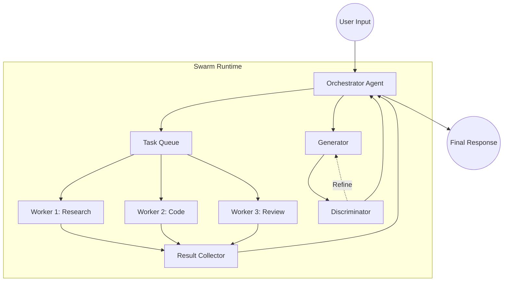

# Implementation Plan — Multi-Agent Swarm

## Architecture



## Proposed Changes

### New File: `bin/harness/swarm.go`
Core swarm module:
- `SwarmConfig` struct (agents, topology)
- `SwarmOrchestrator` — manages delegation and merging
- `SwarmAgent` — individual agent runtime
- `SwarmSession` — multi-agent session tracking
- GAN loop implementation

### New File: `bin/harness/swarm_test.go`
Unit tests for swarm orchestration.

### Modified: `bin/harness/main.go`
- New command: `harness swarm` → interactive swarm mode
- New command: `harness swarm-config` → generate swarm config

### Modified: `bin/harness/client.go`
- Add `Models` and `SwarmConfig` to AppConfig

### Modified: `bin/harness/session.go`
- Add sub-branch/node type for agent-specific DAG nodes

## Implementation Phases

### Phase 1: Core Swarm Types
- Define SwarmConfig, SwarmAgent, SwarmRole types
- Load swarm config from JSON

### Phase 2: Orchestrator Runtime
- Task decomposition logic
- Worker spawning via goroutines
- Result collection and merging

### Phase 3: GAN Pattern
- Generator/Discriminator loop
- Iterative refinement

### Phase 4: CLI & Integration
- `harness swarm` command
- Session DAG logging for multi-agent
- Tests and audit

---

<!-- @sdd-state -->
```yaml
version: "2.3.0"
feature_id: "multi-agent-swarm"
phase: "SPECIFY"
status: "IN_PROGRESS"
last_update: "2026-05-23T18:00:00Z"
evidence_checksum: "plan-draft-v1"
```
