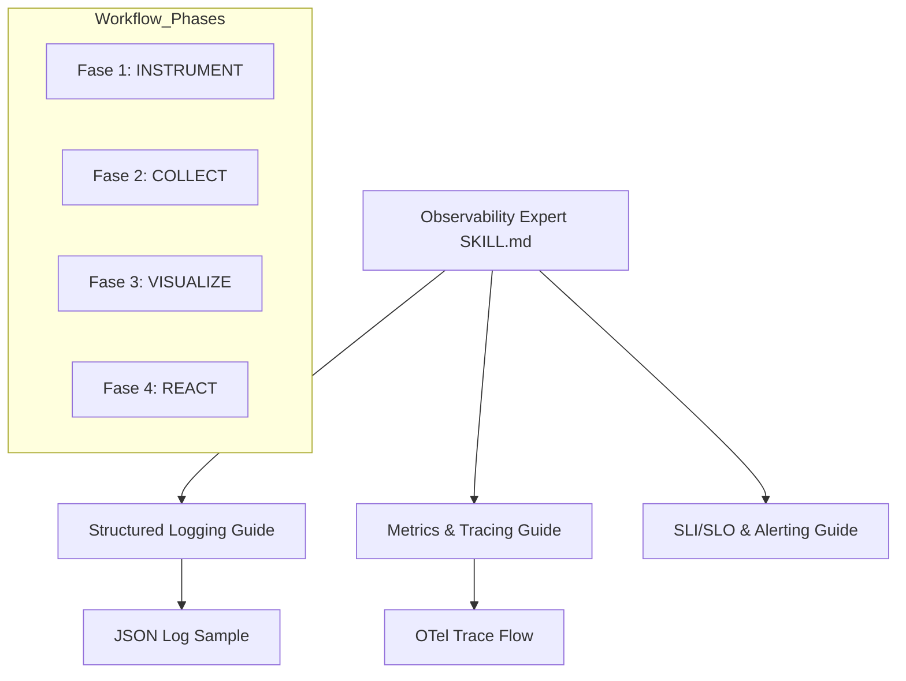

# Plan: Observability Expert Skill Implementation

## Architecture Overview (Mermaid)

## Phase 1: Preparation (Done)
- [x] Analyze observability requirements from `KlebersonCollab/docs`.
- [x] Define `spec.md` with BDD scenarios.

## Phase 2: Core Skill Definition
- [ ] Create `observability-expert/` directory.
- [ ] Draft `observability-expert/CHANGELOG.md`.
- [ ] Draft `observability-expert/README.md`.
- [ ] Draft `observability-expert/SKILL.md` (Main entry point with 4-phase SRE workflow).

## Phase 3: Reference Guides
- [ ] Create `observability-expert/references/` directory.
- [ ] Draft `references/structured-logging.md`.
- [ ] Draft `references/metrics-and-tracing.md`.
- [ ] Draft `references/sli-slo-alerting.md`.

## Phase 4: Examples & Resources
- [ ] Create `observability-expert/examples/` directory.
- [ ] Create `examples/log-format-sample.json`.
- [ ] Create `examples/observability-stack.mermaid`.

## Phase 5: Final Review & Persistence
- [ ] Perform `skill-factory-validator` audit.
- [ ] Register in root `README.md` as Skill #10.
- [ ] Proactively update project specs and roadmap.
