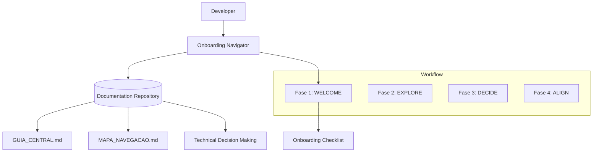

# Plan: Onboarding Navigator Skill Implementation

## Knowledge Interaction Map (Mermaid)

## Phase 1: Preparation (Done)
- [x] Analyze `KlebersonCollab/docs` for navigation and culture guides.
- [x] Define `spec.md` with BDD scenarios.

## Phase 2: Core Skill Definition
- [ ] Create `onboarding-navigator/` directory.
- [ ] Draft `onboarding-navigator/CHANGELOG.md`.
- [ ] Draft `onboarding-navigator/README.md`.
- [ ] Draft `onboarding-navigator/SKILL.md` (Main entry point with navigation workflow).

## Phase 3: Reference Guides
- [ ] Create `onboarding-navigator/references/` directory.
- [ ] Draft `references/decision-making-framework.md`.
- [ ] Draft `references/project-structure-guide.md`.
- [ ] Draft `references/onboarding-checklists.md`.

## Phase 4: Examples & Resources
- [ ] Create `onboarding-navigator/examples/` directory.
- [ ] Create `examples/welcome-guide.md`.
- [ ] Create `examples/decision-flow.mermaid`.

## Phase 5: Final Review & Persistence (MANDATORY TASK UPDATE)
- [ ] Perform `skill-factory-validator` audit.
- [ ] Register in root `README.md` as Skill #11.
- [ ] **Proactively update `tasks.md` to 100% completion.**
- [ ] Update project specs and roadmap.
